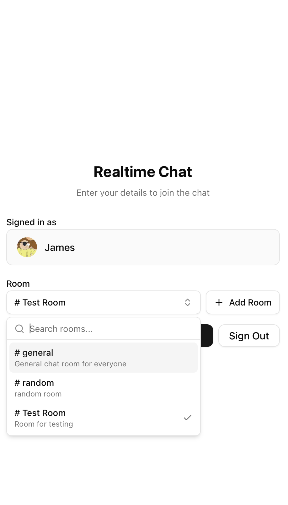

# Realtime Chat Application

A modern, real-time chat application built with Next.js, Supabase, and Redis.
Features instant messaging, message persistence, and reconnection handling.

**Live Demo**:
[https://realtime-chat-react-psi.vercel.app](https://realtime-chat-react-psi.vercel.app)

## Screenshots

    

## Features

- **Real-time messaging** using Supabase Realtime
- **AI Assistant integration** with Claude 3.5 Haiku (Anthropic)
  - Public AI responses (visible to all users)
  - Private AI responses (visible only to requester)
  - Real-time streaming responses
  - Context-aware conversations
- **Message persistence** with automatic message history loading
- **Redis/Vercel KV caching** for improved performance and message tracking
- **Reconnection handling** with missed message recovery
- **Responsive design** with Tailwind CSS
- **TypeScript** for type safety
- **Multiple room support** with isolated conversations
- **Room management** with create and delete capabilities
- **OpenAPI/Swagger documentation** for API endpoints
- **Production deployment** on Vercel with KV storage

## Tech Stack

- **Frontend**: Next.js 15, React 19, TypeScript
- **Styling**: Tailwind CSS v4, Radix UI components
- **Real-time**: Supabase Realtime (WebSocket)
- **Database**: Supabase (PostgreSQL)
- **Caching**: Redis (local) / Vercel KV (production)
- **State Management**: Zustand
- **Package Manager**: Bun
- **Deployment**: Vercel with KV storage

## Prerequisites

- Node.js 22+ (vercel does not support Node 24 currently)
- Bun package manager
- Docker and Docker Compose (for local Redis development)
- Supabase account and project
- Anthropic account (for AI assistant - optional)
- Vercel account (for deployment)

## Environment Setup

1. Create a `.env.local` file in the root directory:

```bash
# Supabase Configuration
NEXT_PUBLIC_SUPABASE_URL=your_supabase_url
NEXT_PUBLIC_SUPABASE_ANON_KEY=your_supabase_anon_key
SUPABASE_SERVICE_ROLE_KEY=your_service_role_key

# AI Assistant Configuration (Anthropic Claude)
ANTHROPIC_API_KEY=your_anthropic_api_key_here

# Authentication Configuration
NEXT_PUBLIC_AUTH_CALLBACK_URL=http://localhost:3000/auth/callback

# Site Configuration
NEXT_PUBLIC_SITE_URL=http://localhost:3000

# Redis Configuration (Local Development)
REDIS_URL=redis://localhost:6379

# Vercel KV Configuration (Production - Auto-configured)
# KV_REST_API_URL=your_vercel_kv_rest_api_url
# KV_REST_API_TOKEN=your_vercel_kv_rest_api_token
# KV_REST_API_READ_ONLY_TOKEN=your_vercel_kv_read_only_token
# KV_URL=your_vercel_kv_url
```

## Authentication Setup

The application uses Supabase Auth with OAuth providers (GitHub and Discord).
Follow these steps to configure authentication:

### 1. OAuth Provider Setup

#### GitHub OAuth App

1. Go to
   [GitHub Developer Settings](https://github.com/settings/applications/new)
2. Create a new OAuth App with these settings:
   - **Application name**: Your app name
   - **Homepage URL**: `http://localhost:3000` (development) or your production
     URL
   - **Authorization callback URL**:
     `https://your-project-id.supabase.co/auth/v1/callback`
   - Replace `your-project-id` with your actual Supabase project ID
3. Copy the **Client ID** and **Client Secret**

#### Discord OAuth App

1. Go to [Discord Developer Portal](https://discord.com/developers/applications)
2. Create a new application
3. Go to **OAuth2** settings
4. Add redirect URI: `https://your-project-id.supabase.co/auth/v1/callback`
5. Copy the **Client ID** and **Client Secret**

### 2. Supabase Configuration

1. Go to your Supabase Dashboard → **Authentication** → **Providers**

2. **Enable GitHub Provider:**
   - Toggle on GitHub
   - Add your GitHub Client ID and Client Secret
   - Save changes

3. **Enable Discord Provider:**
   - Toggle on Discord
   - Add your Discord Client ID and Client Secret
   - Save changes

4. **Configure URL Settings:**
   - Go to **Authentication** → **URL Configuration**
   - **Site URL**:
     - Development: `http://localhost:3000`
     - Production: `https://your-domain.vercel.app`
   - **Redirect URLs**: Add these URLs:
     - Development: `http://localhost:3000/auth/callback`
     - Production: `https://your-domain.vercel.app/auth/callback`

### 3. Environment Variables

Ensure your `.env.local` includes the callback URL:

```bash
# Authentication Configuration
NEXT_PUBLIC_AUTH_CALLBACK_URL=http://localhost:3000/auth/callback
```

For production deployment, set these environment variables in Vercel:

```bash
NEXT_PUBLIC_AUTH_CALLBACK_URL=https://your-domain.vercel.app/auth/callback
NEXT_PUBLIC_SITE_URL=https://your-domain.vercel.app
```

### 4. Important Notes

- **OAuth Flow**: GitHub/Discord → Supabase Auth → Your App
- **Callback URLs**:
  - OAuth providers use: `https://your-project-id.supabase.co/auth/v1/callback`
  - Your app uses: `/auth/callback`
- **Testing**: Make sure to test both providers in development before deploying

### 5. Troubleshooting

If you're getting redirected to the root URL with a code parameter instead of
`/auth/callback`:

1. Check that `NEXT_PUBLIC_AUTH_CALLBACK_URL` is set correctly
2. Verify Supabase redirect URLs include `/auth/callback`
3. Ensure OAuth provider callback URLs point to Supabase (not your app directly)

## AI Assistant

The application includes an AI assistant powered by Anthropic's Claude 3.5
Haiku.

### Add to Environment Variables

Add your Anthropic API key to `.env.local`:

```bash
# AI Assistant Configuration
ANTHROPIC_API_KEY=your_actual_api_key_here
```

## Database Setup

Set up the following tables in your Supabase database:

```sql
-- Messages table (updated schema with AI support)
CREATE TABLE messages (
  id UUID DEFAULT gen_random_uuid() PRIMARY KEY,
  content TEXT NOT NULL,
  room_id TEXT NOT NULL,
  user_id TEXT NOT NULL,
  username TEXT NOT NULL,
  created_at TIMESTAMP WITH TIME ZONE DEFAULT NOW(),
  is_ai_message BOOLEAN DEFAULT false NOT NULL,
  is_private BOOLEAN DEFAULT false NOT NULL
);

-- Add index for efficient private message queries
CREATE INDEX IF NOT EXISTS idx_messages_private_user
ON messages(is_private, user_id)
WHERE is_private = true;

-- Enable RLS
ALTER TABLE messages ENABLE ROW LEVEL SECURITY;

-- Create policies
CREATE POLICY "Anyone can read messages" ON messages FOR SELECT USING (true);
CREATE POLICY "Anyone can insert messages" ON messages FOR INSERT WITH CHECK (true);

-- Rooms table
CREATE TABLE rooms (
  id UUID DEFAULT gen_random_uuid() PRIMARY KEY,
  name TEXT NOT NULL,
  description TEXT,
  created_at TIMESTAMP WITH TIME ZONE DEFAULT NOW()
);

-- Enable RLS for rooms
ALTER TABLE rooms ENABLE ROW LEVEL SECURITY;

-- Room policies
CREATE POLICY "Anyone can read rooms" ON rooms FOR SELECT USING (true);
CREATE POLICY "Anyone can create rooms" ON rooms FOR INSERT WITH CHECK (true);
```

## Installation

1. Clone the repository:

```bash
git clone <repository-url>
cd realtime-chat/react
```

2. Install dependencies:

```bash
bun install
```

3. Start Redis using Docker:

```bash
bun run docker:up
```

4. Start the development server:

```bash
bun run dev
```

5. Open [http://localhost:3000](http://localhost:3000) in your browser.

## API Documentation

Interactive Swagger/OpenAPI documentation is available at:

- **Swagger UI**:
  [http://localhost:3000/api-docs](http://localhost:3000/api-docs)
- **OpenAPI Spec**:
  [http://localhost:3000/api/docs](http://localhost:3000/api/docs)

### Quick Start

1. Start the development server: `bun run dev`
2. Visit `/api-docs` to explore and test all API endpoints
3. Use the "Authorize" button to add your JWT token for authenticated requests

## Available Scripts

### Development

- `bun run dev` - Start development server with Turbopack
- `bun run dev:instance1` - Start on port 3000 (for testing multiple instances)
- `bun run dev:instance2` - Start on port 3001 (for testing multiple instances)

### Build & Production

- `bun run build` - Build the application for production
- `bun run start` - Start the production server

### Code Quality

- `bun run lint` - Run ESLint and TypeScript checks
- `bun run prettier` - Format code with Prettier

### Docker & Redis

- `bun run docker:up` - Start Redis container
- `bun run docker:down` - Stop Redis container
- `bun run docker:logs` - View Redis logs
- `bun run docker:debug` - Start with Redis Commander UI
- `bun run dev:docker` - Start Redis and development server together
- `bun run redis:cli` - Access Redis CLI

## Project Structure

```
src/
├── app/                    # Next.js App Router
│   ├── api/               # API routes
│   │   ├── ai/           # AI assistant endpoints
│   │   ├── docs/         # OpenAPI spec endpoint
│   │   ├── messages/     # Message handling
│   │   └── rooms/        # Room management
│   ├── api-docs/         # Swagger UI documentation page
│   ├── auth/             # Auth pages
│   ├── login/            # login page
│   ├── rooms/[id]        # Room page
│   ├── layout.tsx        # Root layout
│   └── page.tsx         # Main chat interface
├── components/            # React components
│   ├── chat/               # Chat/chatroom related micro components
│   ├── ui/                 # Reusable UI components
│   ├── chat-message.tsx    # Main individual message component
│   └── realtime-chat.tsx   # Main chat room component
├── database/              # Database related schema, SQL, etc
├── hooks/                 # Custom React hooks
├── lib/                   # Utility libraries
│   ├── redis/            # Redis client and utilities
│   ├── services/         # Business logic services
│   ├── stores/           # Zustand state stores
│   ├── supabase/         # Supabase client configuration
│   ├── swagger.ts        # OpenAPI/Swagger configuration
│   └── types/            # TypeScript type definitions
└── docker-compose.yml     # Redis container configuration
```

## Key Components

### Redis/Vercel KV Integration

Used for:

- Message delivery tracking
- Caching recent messages
- Connection state management
- Automatic environment switching (Redis locally, Vercel KV in production)

## Testing Multiple Instances

To test real-time functionality:

1. Start multiple development instances:

```bash
# Terminal 1
bun run dev:instance1

# Terminal 2
bun run dev:instance2
```

2. Open both URLs:
   - http://localhost:3000
   - http://localhost:3001

3. Join the same room with different usernames to test real-time messaging.

## Redis Commander (Debug Mode)

To monitor Redis in development:

```bash
bun run docker:debug
```

Access Redis Commander at [http://localhost:8081](http://localhost:8081)

## Deployment

This application is deployed on Vercel with automatic KV storage integration.

### Database Setup

Run the database setup SQL in your production Supabase instance.

### Redis/KV Architecture

- **Local Development**: Uses Docker Redis container
- **Production**: Automatically uses Vercel KV (Upstash Redis)
- **Automatic Detection**: Client switches based on environment variables

## License

MIT License - see LICENSE file for details.
