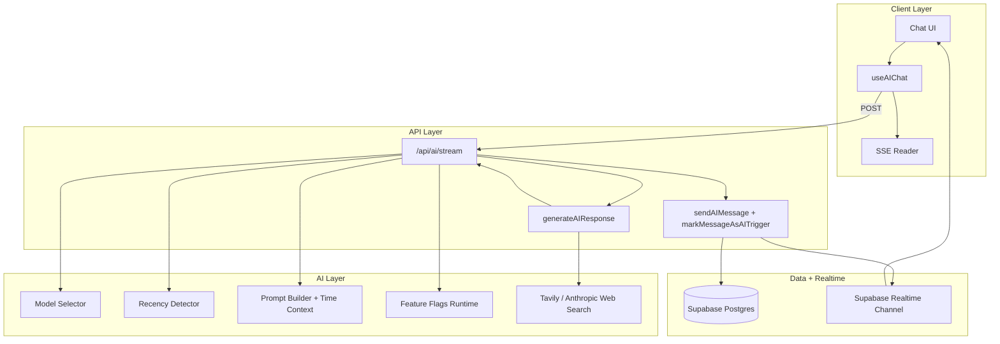
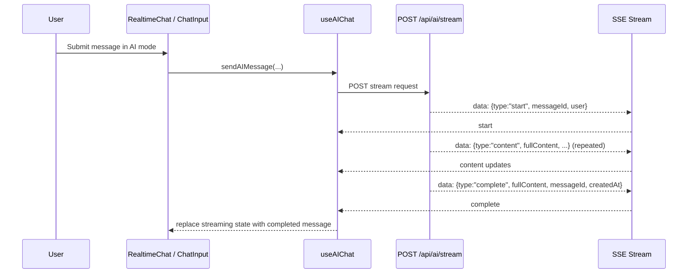
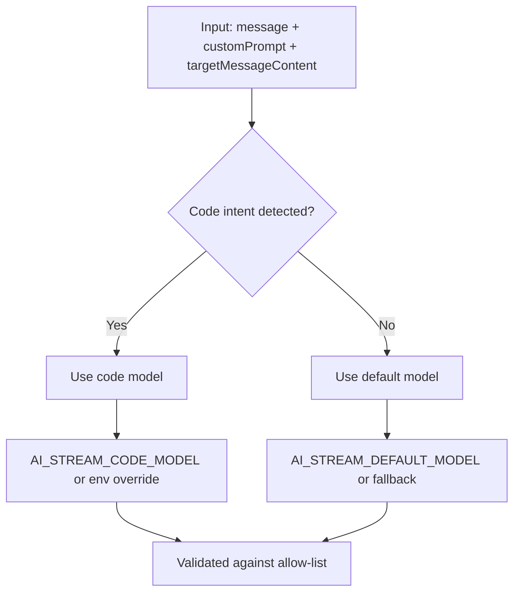
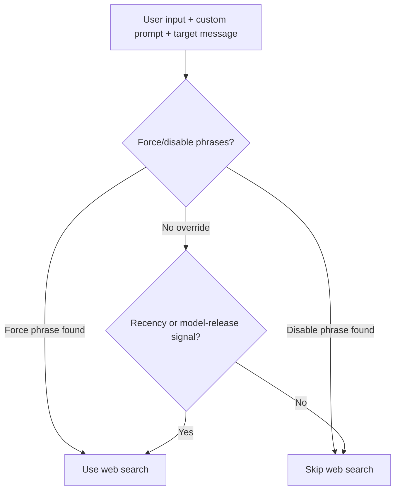
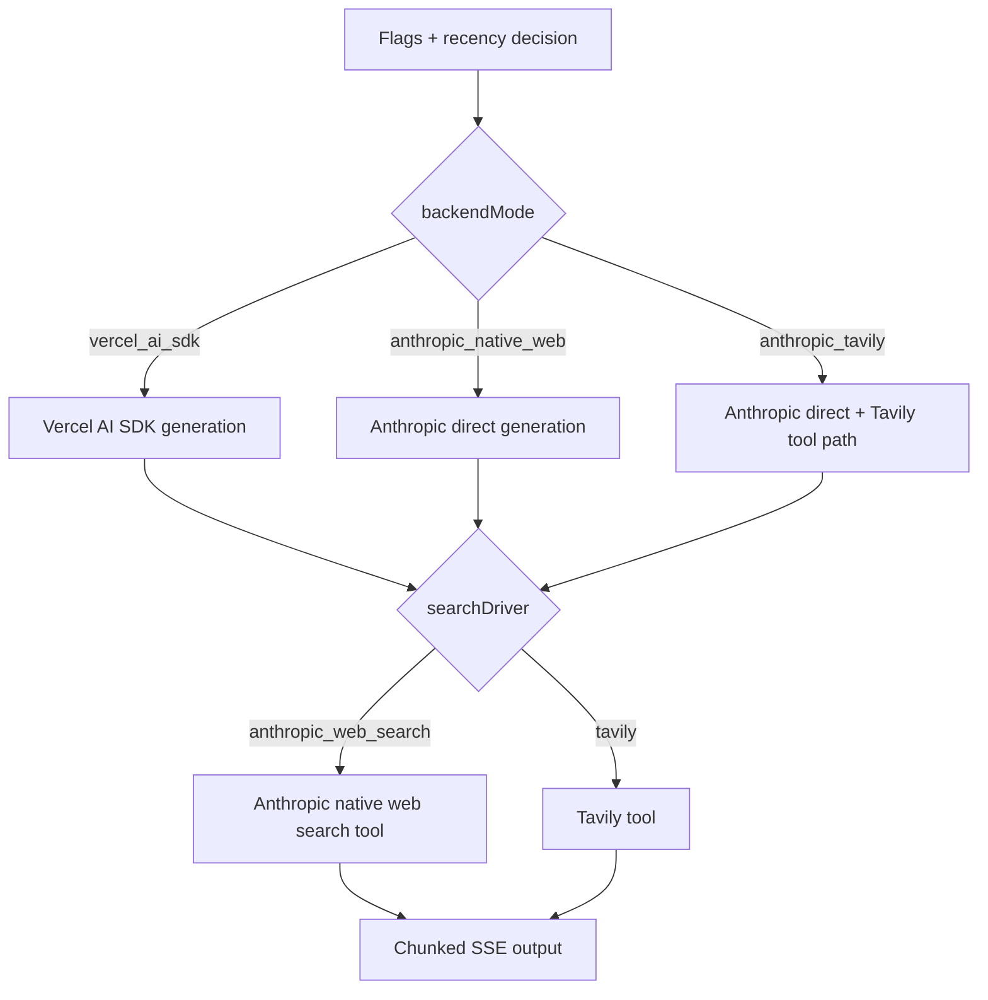
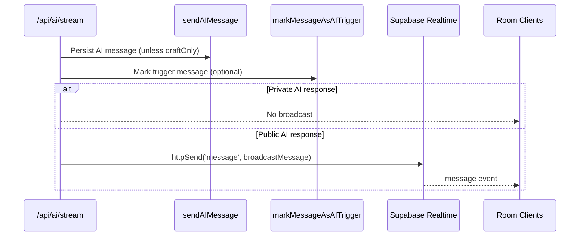
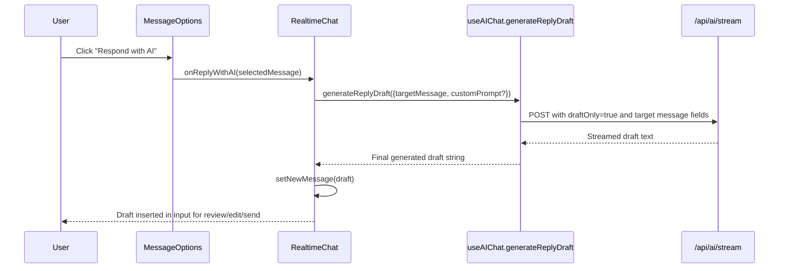

# AI Assistant Architecture

This document provides a comprehensive overview of how the AI assistant works
in the realtime chat application, including streaming flow, model/search
routing, feature flags, and message persistence/broadcast behavior.

## AI Module Layout

The AI assistant uses a layered module split:

1. `app/api/ai/stream/route.ts`

- Auth, validation, prompt assembly, stream orchestration, persistence, and
  broadcast.

2. `lib/ai/*`

- Runtime building blocks for model selection, recency detection, web search,
  stream handling, backend/provider strategy, and feature-flag resolution.

3. `hooks/chat/use-ai-chat.tsx`

- Client-side SSE consumption and UI state management (`start`/`content`/
  `complete` events).

4. `components/chat/*`

- User interaction surfaces for AI mode, private/public behavior, and
  "Respond with AI" draft generation from a selected message.

## Change Timeline (AI Enhancements)

The core AI enhancement set landed on **February 10, 2026** (JST) and was merged
through **PR #25 (`feat/ai-input-reply`)**:

1. `a9e66b5` (2026-02-10T19:28:01+09:00)
- Added internet-aware AI behavior, model selector, and AI reply draft input
  flow.

2. `a770abe` (2026-02-10T19:39:52+09:00)
- Added recency-aware routing improvements for up-to-date prompts.

3. `cee8eb0` (2026-02-10T20:37:03+09:00)
- Added alternative backend/provider strategy with feature-flagged routing.

4. `c4925e7`
- Merge commit for PR #25 into `main`.

## Table of Contents

- [System Overview](#system-overview)
- [AI Flow Layers](#ai-flow-layers)
- [Client to API Stream Flow](#client-to-api-stream-flow)
- [Prompt and Context Assembly](#prompt-and-context-assembly)
- [Model Selection Flow](#model-selection-flow)
- [Web Search and Recency Flow](#web-search-and-recency-flow)
- [Backend Strategy and Provider Routing](#backend-strategy-and-provider-routing)
- [Message Persistence and Broadcast Flow](#message-persistence-and-broadcast-flow)
- [AI Reply Draft Flow](#ai-reply-draft-flow)
- [SSE Event Contract](#sse-event-contract)
- [Failure Handling and Fallbacks](#failure-handling-and-fallbacks)

## System Overview

The assistant is a streaming pipeline with runtime strategy routing:

## AI Flow Layers

### Layer 1: Client Interaction

1. User enables AI mode from `AIBadge` in chat input.
2. User submits a message or chooses "Respond with AI" from message options.
3. `useAIChat` sends request and listens to SSE events.

### Layer 2: API Gateway

1. `requireNonAnonymousAuth` enforces authenticated, non-anonymous access.
2. Zod schema validation (`aiStreamRequestSchema`) verifies payload shape and
   limits.
3. Route builds prompt/messages and selects model + strategy.

### Layer 3: AI Strategy Execution

1. Strategy chooses backend mode (`anthropic_tavily`,
   `anthropic_native_web`, `vercel_ai_sdk`).
2. Recency detector decides whether web search should be attempted.
3. Generation returns either:
- Native token stream (`native_stream`) or
- Full text chunked into SSE (`chunked`).

### Layer 4: Persistence and Realtime

1. If `draftOnly` is false, final AI content is stored via `sendAIMessage`.
2. Trigger message can be marked (`markMessageAsAITrigger`).
3. Public AI messages are broadcast to room channel; private AI messages are not
   broadcast.

## Client to API Stream Flow

## Prompt and Context Assembly

The server builds prompt context from:

1. Base system prompt:
- `AI_STREAM_SYSTEM_PROMPT` for plain text
- `AI_STREAM_MARKDOWN_SYSTEM_PROMPT` for markdown

2. Optional web-search policy instructions:
- Appended only when recency/search is requested and enabled

3. Current-time context:
- UTC ISO + UTC text injected into `CURRENT_TIME_CONTEXT_TEMPLATE`
- Relative time words (today/yesterday/last week) should anchor to this context

4. Conversation context:
- `previousMessages` mapped into Anthropic message format
- Current user input appended as final user turn

5. Reply-draft mode context:
- If `targetMessageId + targetMessageContent` are present, route creates a
  constrained drafting instruction so output is only the reply text.

## Model Selection Flow

Routing logic (`resolveAIModel`) uses:

1. Code patterns (fenced blocks, function/class syntax, stack traces, import/export)
2. Action hints (implement/debug/refactor/show code)
3. Language hints (TypeScript, Python, Go, Rust, etc.)
4. Concept-only hints to avoid code model for explanation-only prompts

## Web Search and Recency Flow

Recency detector (`shouldUseWebSearch`) triggers on patterns like:

1. `latest`, `today`, `current`, `price`, `weather`, `score`, `breaking news`
2. Leadership/title queries (`who is the president/ceo/prime minister`)
3. Model/version release signals (model names + version/release keywords)

Tavily path behavior:

1. Query sent via `searchWeb()`.
2. Results are normalized/sanitized and sorted by published date (newest first).
3. Source links are appended as a markdown `Sources:` line when available.
4. Quota/rate errors trigger temporary cooldown (`disableTavilyTemporarily`) and
   fallback to non-search generation.

## Backend Strategy and Provider Routing

Strategy entrypoint is `generateAIResponse()` and returns either:

1. `native_stream`: direct Anthropic token stream
2. `chunked`: full response split into chunks for SSE emission

Feature flags are resolved through runtime logic (`getEffectiveAIFlags`) with:

1. Backend mode
2. Search driver
3. Fail-open behavior
4. SDK enable/provider
5. Migration mode (`shadow` vs `active`)

## Message Persistence and Broadcast Flow

Broadcast path has primary + fallback sender:

1. Primary: service-role Supabase client
2. Fallback: request-bound Supabase client

## AI Reply Draft Flow

This feature powers "Respond with AI" from message context menus.

Behavior details:

1. Draft generation does not persist a chat message (`draftOnly=true`).
2. Output is inserted into input box; user controls final send.
3. Optional custom prompt lets user constrain tone/style/length.

## SSE Event Contract

The stream emits line-delimited events:

1. `start`
- Contains temporary message ID and AI user metadata.

2. `content`
- Contains incremental chunk and cumulative `fullContent`.

3. `complete`
- Contains final content, persisted message ID (or temp ID for draft), and
  created timestamp.

4. `error`
- Contains formatted error text.

Client parsing in `useAIChat` updates streaming state in-place until completion.

## Failure Handling and Fallbacks

Key resilience behavior:

1. Request-level guards
- Auth check, payload validation, self-user enforcement, API key checks.

2. Search fallback
- Tavily quota/rate limits trigger cooldown and fallback to non-search path.

3. Strategy fallback
- `vercel_ai_sdk` mode can fail-open to alternate generation depending on
  `failOpen` flag.

4. Broadcast fallback
- If service broadcast fails, fallback client broadcast is attempted.

5. Client fallback
- On stream/API error, chat renders a user-visible AI error message.

This keeps the chat flow responsive even when search/tools/providers are
partially unavailable.
