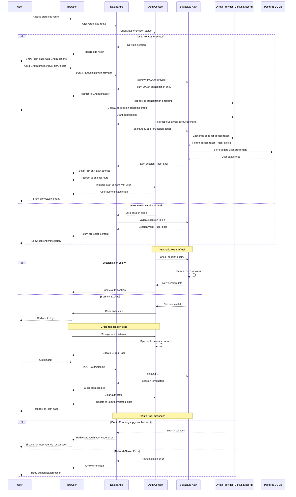

# Authentication System Documentation

## Overview

This document outlines the authentication architecture for the realtime chat
application. The system leverages Supabase Auth with OAuth providers to ensure
secure user authentication, session management, and protected access to chat
functionality.

## Authentication Flow



## System Architecture

### Core Components

1. **OAuth Integration Layer**
   - GitHub OAuth Provider
   - Discord OAuth Provider
   - OAuth callback handling
   - Error management

2. **Session Management**
   - Supabase Auth session handling
   - HTTP-only cookie storage
   - Automatic token refresh
   - Cross-tab session sync

3. **Authentication Context**
   - React context for auth state
   - User profile management
   - Loading state handling
   - Auth state persistence

## OAuth Providers

### Supported Authentication Methods

**GitHub OAuth**

- Industry-standard OAuth 2.0 flow
- Automatically retrieves user profile data
- Includes username, email, and avatar
- Secure token-based authentication

**Discord OAuth**

- Discord application integration
- Access to user profile information
- Seamless authentication experience
- Compatible with existing Discord accounts

### OAuth Configuration Requirements

**Supabase Dashboard Setup:**

1. Navigate to Authentication → Providers
2. Enable desired OAuth providers
3. Configure client credentials from provider dashboards
4. Set callback URLs to Supabase auth endpoint

**Provider-Specific Setup:**

- **GitHub:** Create OAuth App at GitHub Developer Settings
- **Discord:** Create Application at Discord Developer Portal
- Both require client ID and client secret configuration

## Database Integration

### Authentication Schema

**Messages Table**

- `user_id`: Links to authenticated user
- `username`: Display name from OAuth provider
- `room_id`: Associates messages with chat rooms
- `content`: Message content
- `created_at`: Timestamp for message ordering

**Rooms Table**

- `id`: Unique room identifier
- `name`: Human-readable room name
- `description`: Optional room description
- `created_at`: Room creation timestamp

### Data Flow

```
Authenticated User → Message Creation → Database Storage → Real-time Broadcast
       ↓                    ↓                 ↓                    ↓
   User Profile      Message Content    Persistent Storage    Live Updates
   Information       Validation         with User Data        to All Users
```

## Security Architecture

### Session Management

- **Secure Cookies**: HTTP-only, secure cookies for session storage
- **Auto-Refresh**: Automatic token refresh handled by Supabase
- **Cross-Tab Sync**: Session state synchronized across browser tabs
- **Logout Cleanup**: Complete session termination on logout

### Route Protection

- **Client-Side Guards**: Authentication checks before route access
- **Automatic Redirects**: Unauthenticated users redirected to login
- **Loading States**: Smooth UX during authentication verification
- **Error Handling**: Graceful handling of auth failures

### Data Security

- **User Association**: All messages linked to authenticated users
- **Profile Integration**: OAuth provider data automatically used
- **Secure API Calls**: Authenticated requests to backend services
- **Token Management**: Secure token storage and transmission

## User Experience Flow

### Authentication Journey

**Step 1: Initial Access**

- User attempts to access chat application
- System checks for existing authentication
- Redirects to login if not authenticated

**Step 2: Provider Selection**

- User presented with GitHub and Discord options
- Single-click authentication initiation
- Loading states during OAuth redirect

**Step 3: OAuth Authorization**

- User redirected to selected provider
- Permission grant for application access
- Provider redirects back with authorization code

**Step 4: Session Establishment**

- Application exchanges code for session
- User profile data retrieved and stored
- Secure cookie set for future requests

**Step 5: Chat Access**

- User redirected to main application
- Full access to chat functionality
- Profile information displayed in UI

### Profile Management

**Automatic Profile Population**

- Display name from OAuth provider metadata
- Profile picture from provider account
- Email address for identification
- No manual profile setup required

**Profile Display**

- User avatar shown in chat interface
- Username displayed with messages
- Profile information in user settings
- Consistent identity across sessions

## Technical Architecture

### Component Hierarchy

```
Application Root
├── AuthProvider (Context)
│   ├── Authentication State
│   ├── User Profile Data
│   └── Session Management
├── Protected Routes
│   ├── Route Guards
│   ├── Loading States
│   └── Redirect Logic
└── Chat Components
    ├── Message Display
    ├── User Identification
    └── Real-time Updates
```

### State Management

**Authentication Context**

- Global user state management
- Authentication status tracking
- Profile data storage
- Loading state coordination

**Session Persistence**

- Automatic session restoration on page load
- Cross-tab session synchronization
- Secure token storage in HTTP-only cookies
- Graceful handling of session expiration

## Environment Configuration

### Required Variables

**Supabase Configuration**

- `NEXT_PUBLIC_SUPABASE_URL`: Project URL
- `NEXT_PUBLIC_SUPABASE_ANON_KEY`: Anonymous access key
- `SUPABASE_SERVICE_ROLE_KEY`: Server-side operations key

**Authentication Configuration**

- `NEXT_PUBLIC_AUTH_CALLBACK_URL`: OAuth callback URL (defaults to
  `/auth/callback`)

**OAuth Provider Configuration**

- Configured through Supabase Dashboard
- Client IDs and secrets from provider apps
- Callback URLs properly configured

### Deployment Considerations

**Production Setup**

- Secure environment variable management
- HTTPS required for OAuth flows
- Set `NEXT_PUBLIC_AUTH_CALLBACK_URL` to production domain
- Rate limiting and monitoring

**Development Setup**

- Local environment configuration
- Development OAuth applications
- Set `NEXT_PUBLIC_AUTH_CALLBACK_URL` to `http://localhost:3000/auth/callback`
- Debug logging for troubleshooting

## Implementation Status

### ✅ Completed Features

**Core Authentication**

- Supabase Auth integration
- GitHub and Discord OAuth providers
- Session management and persistence
- Protected route implementation

**User Interface**

- Login page with provider buttons
- User profile display components
- Loading states and error handling
- Logout functionality

**Database Integration**

- Authenticated message storage
- User profile data integration
- Real-time chat with user identity
- Message persistence with user context

### 🔄 Future Enhancements

**Advanced Security**

- Row-level security policies
- Rate limiting implementation
- Content moderation system
- User blocking and reporting

**User Management**

- Extended user profile system
- Room membership management
- User roles and permissions
- Online presence tracking

**Administrative Features**

- Admin dashboard for user management
- Audit logging and monitoring
- Advanced security controls
- System health monitoring
