# Data Flow Architecture

This document provides a comprehensive overview of how data flows through the
realtime chat application, including React Query integration, WebSocket updates,
and cache management.

## Table of Contents

- [System Overview](#system-overview)
- [Data Flow Layers](#data-flow-layers)
- [React Query Integration](#react-query-integration)
- [Message Flow](#message-flow)
- [Room Management Flow](#room-management-flow)
- [Cache Strategy](#cache-strategy)
- [Realtime Updates](#realtime-updates)

## System Overview

The application uses a multi-layered architecture with distinct data flows:

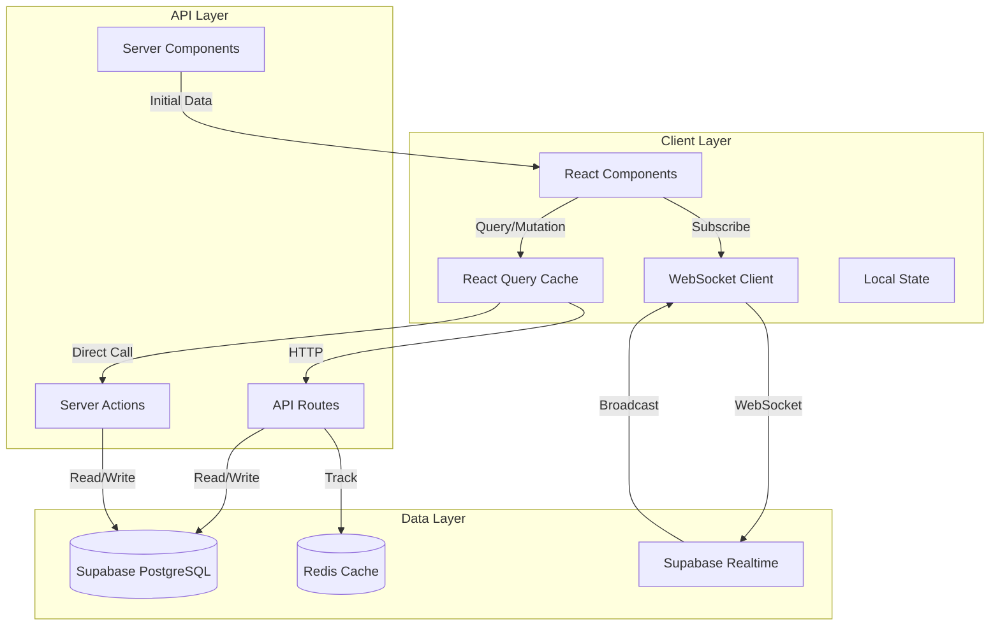
```mermaid
graph TB
    subgraph "Client Layer"
        UI[React Components]
        RQ[React Query Cache]
        WS[WebSocket Client]
        LS[Local State]
    end

    subgraph "API Layer"
        API[API Routes]
        SA[Server Actions]
        SSR[Server Components]
    end

    subgraph "Data Layer"
        DB[(Supabase PostgreSQL)]
        Redis[(Redis Cache)]
        RT[Supabase Realtime]
    end

    UI -->|Query/Mutation| RQ
    RQ -->|HTTP| API
    RQ -->|Direct Call| SA
    UI -->|Subscribe| WS
    WS -->|WebSocket| RT
    API -->|Read/Write| DB
    SA -->|Read/Write| DB
    API -->|Track| Redis
    RT -->|Broadcast| WS
    SSR -->|Initial Data| UI
```

## Data Flow Layers

### Layer 1: Client-Side State

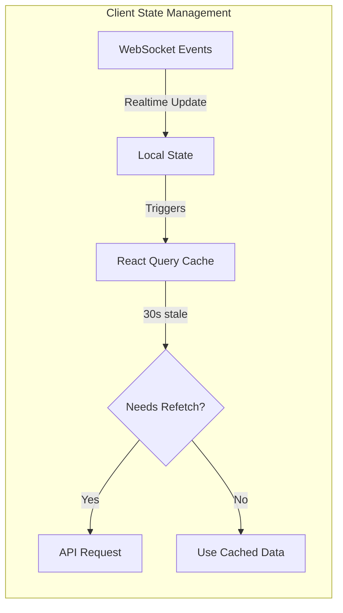
```mermaid
flowchart LR
    subgraph "Client State Management"
        A[React Query Cache] -->|30s stale| B{Needs Refetch?}
        B -->|Yes| C[API Request]
        B -->|No| D[Use Cached Data]
        E[WebSocket Events] -->|Realtime Update| F[Local State]
        F -->|Triggers| A
    end
```

### Layer 2: API Communication

Three types of API communication:

1. **HTTP API Routes** - Traditional REST endpoints
2. **Server Actions** - Next.js server-side functions
3. **WebSocket** - Realtime bidirectional communication

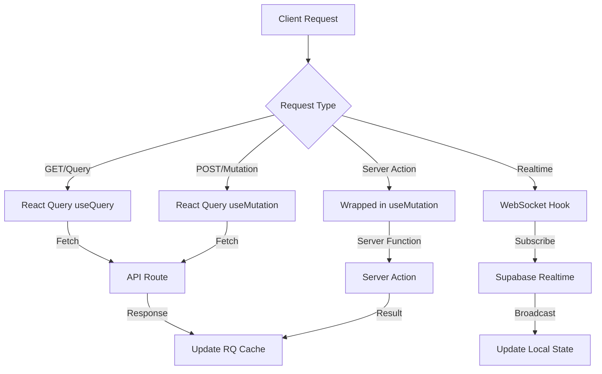
```mermaid
flowchart TD
    A[Client Request] --> B{Request Type}
    B -->|GET/Query| C[React Query useQuery]
    B -->|POST/Mutation| D[React Query useMutation]
    B -->|Server Action| E[Wrapped in useMutation]
    B -->|Realtime| F[WebSocket Hook]

    C -->|Fetch| G[API Route]
    D -->|Fetch| G
    E -->|Server Function| H[Server Action]
    F -->|Subscribe| I[Supabase Realtime]

    G -->|Response| J[Update RQ Cache]
    H -->|Result| J
    I -->|Broadcast| K[Update Local State]
```

## React Query Integration

### Query Flow (GET Requests)

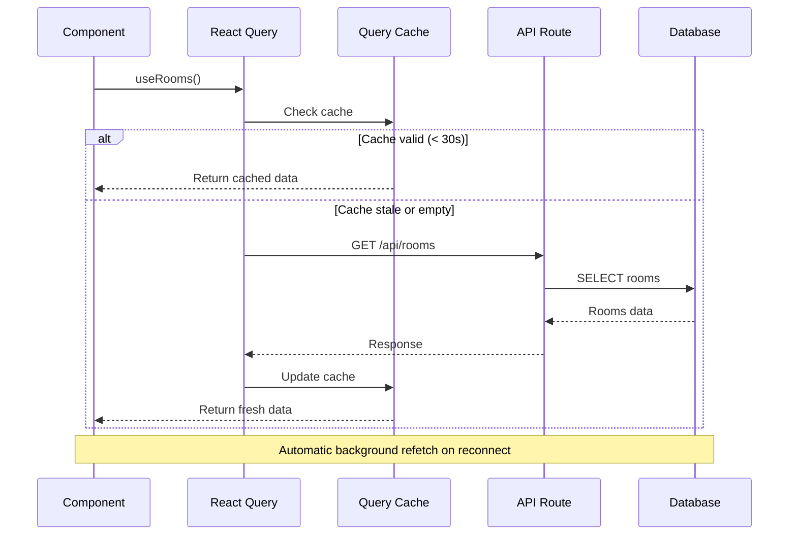
```mermaid
sequenceDiagram
    participant UI as Component
    participant RQ as React Query
    participant Cache as Query Cache
    participant API as API Route
    participant DB as Database

    UI->>RQ: useRooms()
    RQ->>Cache: Check cache

    alt Cache valid (< 30s)
        Cache-->>UI: Return cached data
    else Cache stale or empty
        RQ->>API: GET /api/rooms
        API->>DB: SELECT rooms
        DB-->>API: Rooms data
        API-->>RQ: Response
        RQ->>Cache: Update cache
        Cache-->>UI: Return fresh data
    end

    Note over UI,DB: Automatic background refetch on reconnect
```

### Mutation Flow (POST/DELETE Requests)

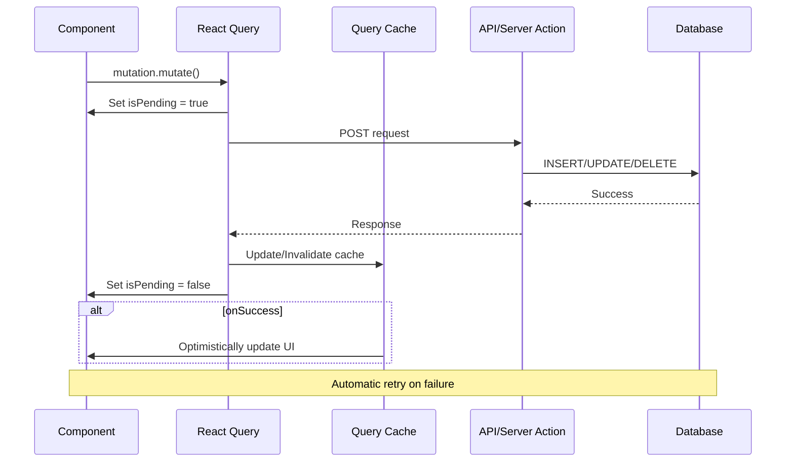
```mermaid
sequenceDiagram
    participant UI as Component
    participant RQ as React Query
    participant Cache as Query Cache
    participant API as API/Server Action
    participant DB as Database

    UI->>RQ: mutation.mutate()
    RQ->>UI: Set isPending = true

    RQ->>API: POST request
    API->>DB: INSERT/UPDATE/DELETE
    DB-->>API: Success

    API-->>RQ: Response
    RQ->>Cache: Update/Invalidate cache
    RQ->>UI: Set isPending = false

    alt onSuccess
        Cache->>UI: Optimistically update UI
    end

    Note over UI,DB: Automatic retry on failure
```

### Server Action Mutation Flow

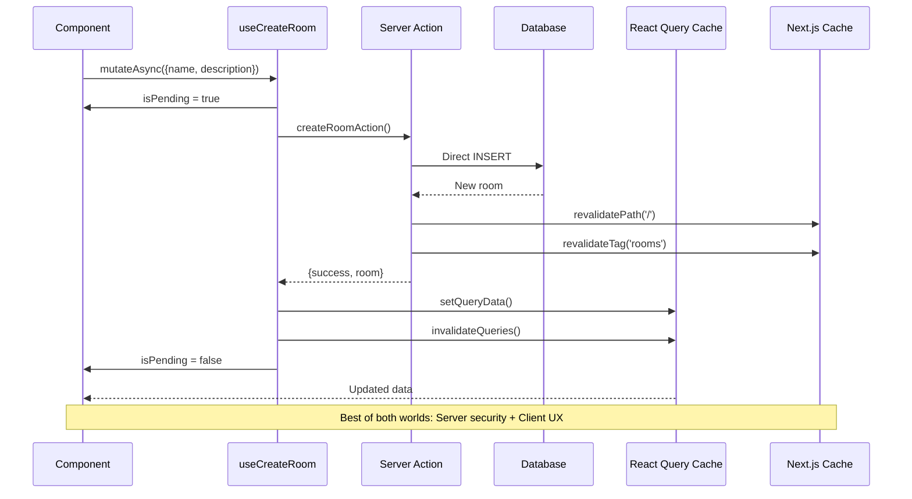
```mermaid
sequenceDiagram
    participant UI as Component
    participant Mutation as useCreateRoom
    participant SA as Server Action
    participant DB as Database
    participant RQCache as React Query Cache
    participant NextCache as Next.js Cache

    UI->>Mutation: mutateAsync({name, description})
    Mutation->>UI: isPending = true

    Mutation->>SA: createRoomAction()
    SA->>DB: Direct INSERT
    DB-->>SA: New room
    SA->>NextCache: revalidatePath('/')
    SA->>NextCache: revalidateTag('rooms')
    SA-->>Mutation: {success, room}

    Mutation->>RQCache: setQueryData()
    Mutation->>RQCache: invalidateQueries()
    Mutation->>UI: isPending = false
    RQCache-->>UI: Updated data

    Note over UI,NextCache: Best of both worlds: Server security + Client UX
```

## Message Flow

### Sending a Message (Complete Flow)

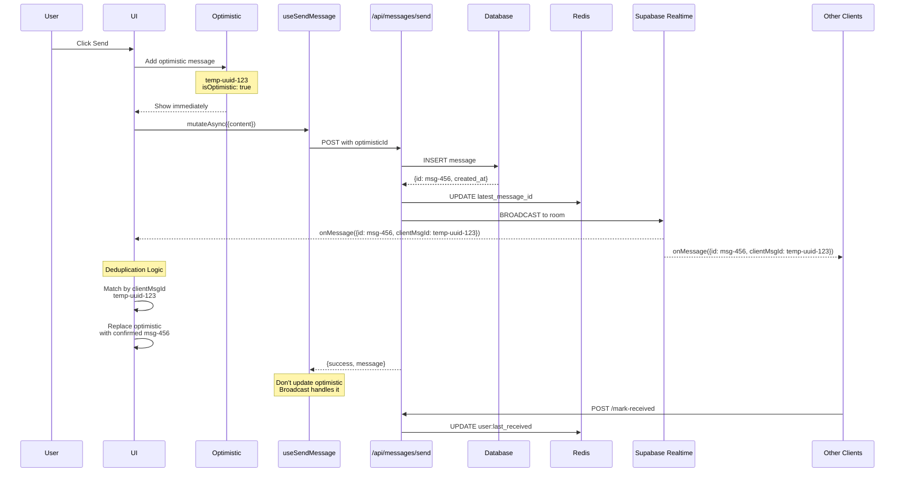
```mermaid
sequenceDiagram
    participant User
    participant UI
    participant Optimistic
    participant Mutation as useSendMessage
    participant API as /api/messages/send
    participant DB as Database
    participant Redis
    participant RT as Supabase Realtime
    participant Others as Other Clients

    User->>UI: Click Send
    UI->>Optimistic: Add optimistic message
    Note over Optimistic: temp-uuid-123<br/>isOptimistic: true
    Optimistic-->>UI: Show immediately

    UI->>Mutation: mutateAsync({content})
    Mutation->>API: POST with optimisticId

    API->>DB: INSERT message
    DB-->>API: {id: msg-456, created_at}

    API->>Redis: UPDATE latest_message_id
    API->>RT: BROADCAST to room

    RT-->>UI: onMessage({id: msg-456, clientMsgId: temp-uuid-123})
    RT-->>Others: onMessage({id: msg-456, clientMsgId: temp-uuid-123})

    Note over UI: Deduplication Logic
    UI->>UI: Match by clientMsgId<br/>temp-uuid-123
    UI->>UI: Replace optimistic<br/>with confirmed msg-456

    API-->>Mutation: {success, message}
    Note over Mutation: Don't update optimistic<br/>Broadcast handles it

    Others->>API: POST /mark-received
    API->>Redis: UPDATE user:last_received
```

### Message Deduplication Strategy

The application uses a **hybrid deduplication approach** with primary deterministic matching and fallback heuristics:

**Primary Path: clientMsgId Matching (Real-time Broadcasts)**
1. Client generates a unique `optimisticId` (UUID) when sending a message
2. Server receives the message, stores it with a new server-generated `id`
3. Server echoes back the `optimisticId` as `clientMsgId` in the WebSocket broadcast
4. Client matches the broadcast message to the optimistic message using `clientMsgId`
5. Optimistic message is replaced with the confirmed server message

**Fallback Path: Content + Timestamp Heuristic (Missed Messages from DB)**
1. If broadcast is missed (network issue, brief disconnect), message won't have `clientMsgId`
2. On reconnect, missed messages are fetched from database (no `clientMsgId` in DB)
3. Client falls back to matching by: same content + same user + within 5 seconds
4. This preserves deduplication when the deterministic path isn't available

**Why this hybrid approach:**
- **Primary**: Deterministic UUID matching handles repeated identical messages ("ok", "👍")
- **Fallback**: Content/timestamp heuristic prevents duplicates when broadcasts are missed
- **Resilient**: Works correctly in both real-time and reconnection scenarios
- **Interview-friendly**: Shows understanding of edge cases and graceful degradation

**Edge cases handled:**
- ✅ User sends repeated identical messages → Primary path handles it
- ✅ Broadcast missed, DB fetch on reconnect → Fallback path handles it
- ✅ Multiple "ok" messages in quick succession → Primary path distinguishes by UUID

### Missed Messages on Reconnect

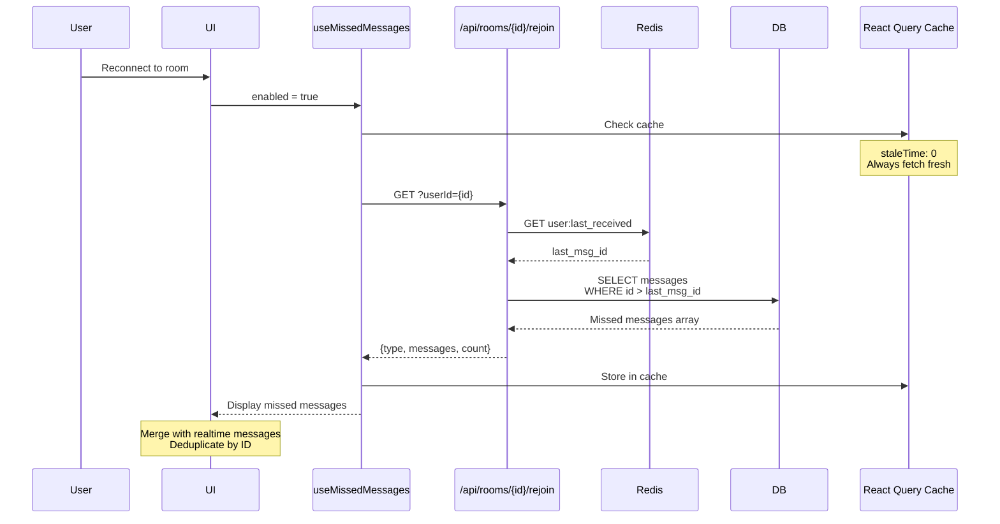
```mermaid
sequenceDiagram
    participant User
    participant UI
    participant Query as useMissedMessages
    participant API as /api/rooms/{id}/rejoin
    participant Redis
    participant DB
    participant RQCache as React Query Cache

    User->>UI: Reconnect to room
    UI->>Query: enabled = true
    Query->>RQCache: Check cache
    Note over RQCache: staleTime: 0<br/>Always fetch fresh

    Query->>API: GET ?userId={id}
    API->>Redis: GET user:last_received
    Redis-->>API: last_msg_id

    API->>DB: SELECT messages<br/>WHERE id > last_msg_id
    DB-->>API: Missed messages array

    API-->>Query: {type, messages, count}
    Query->>RQCache: Store in cache
    Query-->>UI: Display missed messages

    Note over UI: Merge with realtime messages<br/>Deduplicate by ID
```

## Room Management Flow

### Creating a Room

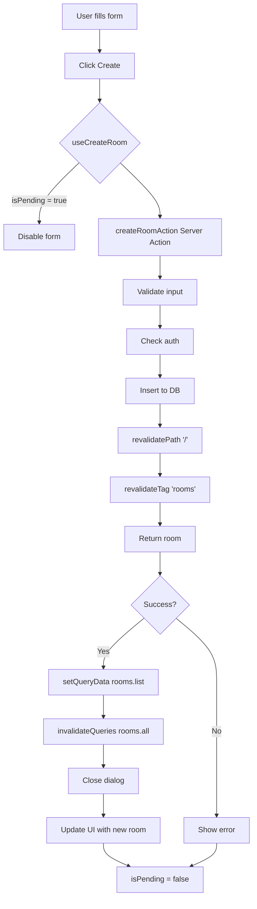
```mermaid
flowchart TD
    A[User fills form] --> B[Click Create]
    B --> C{useCreateRoom}
    C -->|isPending = true| D[Disable form]

    C --> E[createRoomAction Server Action]
    E --> F[Validate input]
    F --> G[Check auth]
    G --> H[Insert to DB]
    H --> I[revalidatePath '/']
    I --> J[revalidateTag 'rooms']

    J --> K[Return room]
    K --> L{Success?}

    L -->|Yes| M[setQueryData rooms.list]
    M --> N[invalidateQueries rooms.all]
    N --> O[Close dialog]
    O --> P[Update UI with new room]

    L -->|No| Q[Show error]

    P --> R[isPending = false]
    Q --> R
```

### Deleting a Room

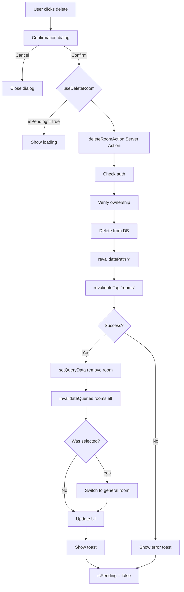
```mermaid
flowchart TD
    A[User clicks delete] --> B[Confirmation dialog]
    B -->|Cancel| C[Close dialog]
    B -->|Confirm| D{useDeleteRoom}

    D -->|isPending = true| E[Show loading]
    D --> F[deleteRoomAction Server Action]

    F --> G[Check auth]
    G --> H[Verify ownership]
    H --> I[Delete from DB]
    I --> J[revalidatePath '/']
    J --> K[revalidateTag 'rooms']

    K --> L{Success?}

    L -->|Yes| M[setQueryData remove room]
    M --> N[invalidateQueries rooms.all]
    N --> O{Was selected?}
    O -->|Yes| P[Switch to general room]
    O -->|No| Q[Update UI]
    P --> Q
    Q --> R[Show toast]

    L -->|No| S[Show error toast]

    R --> T[isPending = false]
    S --> T
```

### Fetching Rooms (SSR + Client)

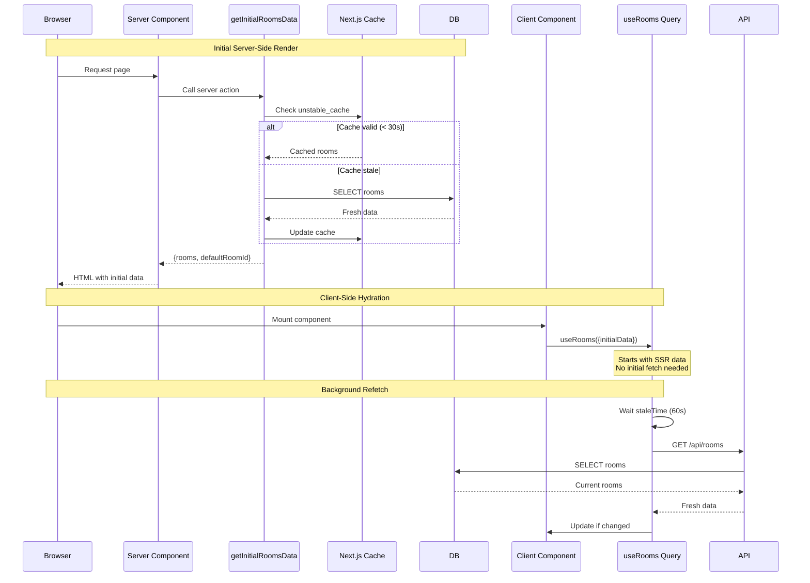
```mermaid
sequenceDiagram
    participant Browser
    participant SSR as Server Component
    participant SA as getInitialRoomsData
    participant Cache as Next.js Cache
    participant DB
    participant UI as Client Component
    participant RQ as useRooms Query

    Note over Browser,DB: Initial Server-Side Render

    Browser->>SSR: Request page
    SSR->>SA: Call server action
    SA->>Cache: Check unstable_cache

    alt Cache valid (< 30s)
        Cache-->>SA: Cached rooms
    else Cache stale
        SA->>DB: SELECT rooms
        DB-->>SA: Fresh data
        SA->>Cache: Update cache
    end

    SA-->>SSR: {rooms, defaultRoomId}
    SSR-->>Browser: HTML with initial data

    Note over Browser,RQ: Client-Side Hydration

    Browser->>UI: Mount component
    UI->>RQ: useRooms({initialData})
    Note over RQ: Starts with SSR data<br/>No initial fetch needed

    Note over Browser,RQ: Background Refetch

    RQ->>RQ: Wait staleTime (60s)
    RQ->>API: GET /api/rooms
    API->>DB: SELECT rooms
    DB-->>API: Current rooms
    API-->>RQ: Fresh data
    RQ->>UI: Update if changed
```

## Cache Strategy

### React Query Cache Hierarchy

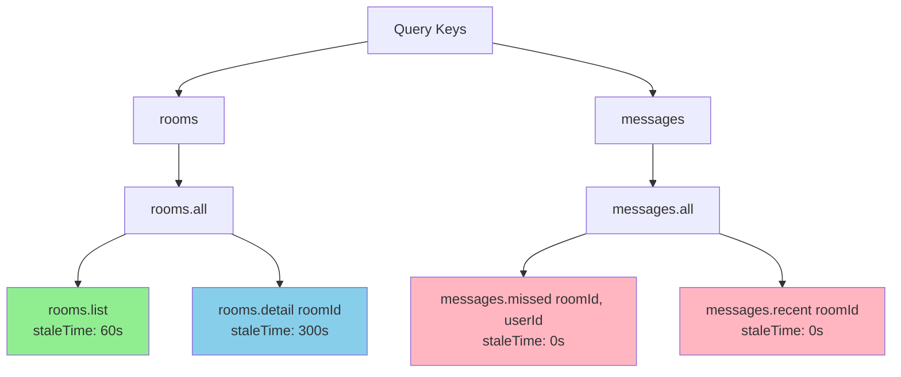
```mermaid
graph TD
    A[Query Keys] --> B[rooms]
    A --> C[messages]

    B --> D[rooms.all]
    D --> E[rooms.list<br/>staleTime: 60s]
    D --> F[rooms.detail roomId<br/>staleTime: 300s]

    C --> G[messages.all]
    G --> H[messages.missed roomId, userId<br/>staleTime: 0s]
    G --> I[messages.recent roomId<br/>staleTime: 0s]

    style E fill:#90EE90
    style F fill:#87CEEB
    style H fill:#FFB6C1
    style I fill:#FFB6C1
```

### Cache Update Strategies

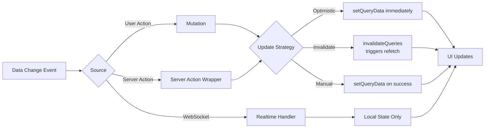
```mermaid
flowchart LR
    A[Data Change Event] --> B{Source}

    B -->|User Action| C[Mutation]
    B -->|Server Action| D[Server Action Wrapper]
    B -->|WebSocket| E[Realtime Handler]

    C --> F{Update Strategy}
    D --> F
    E --> G[Local State Only]

    F -->|Optimistic| H[setQueryData immediately]
    F -->|Invalidate| I[invalidateQueries<br/>triggers refetch]
    F -->|Manual| J[setQueryData on success]

    H --> K[UI Updates]
    I --> K
    J --> K
    G --> K
```

### Cache Sync with Server Actions

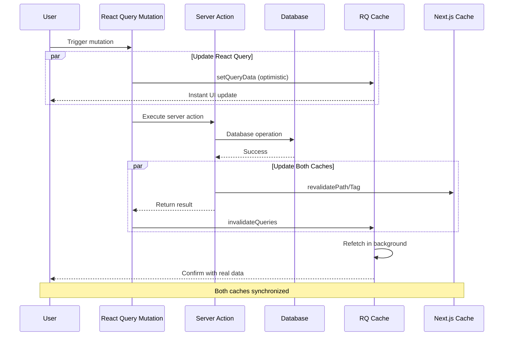
```mermaid
sequenceDiagram
    participant User
    participant Mutation as React Query Mutation
    participant SA as Server Action
    participant DB as Database
    participant RQCache as RQ Cache
    participant NextCache as Next.js Cache

    User->>Mutation: Trigger mutation

    par Update React Query
        Mutation->>RQCache: setQueryData (optimistic)
        RQCache-->>User: Instant UI update
    end

    Mutation->>SA: Execute server action
    SA->>DB: Database operation
    DB-->>SA: Success

    par Update Both Caches
        SA->>NextCache: revalidatePath/Tag
        SA-->>Mutation: Return result
        Mutation->>RQCache: invalidateQueries
    end

    RQCache->>RQCache: Refetch in background
    RQCache-->>User: Confirm with real data

    Note over User,NextCache: Both caches synchronized
```

## Realtime Updates

### WebSocket Message Broadcasting

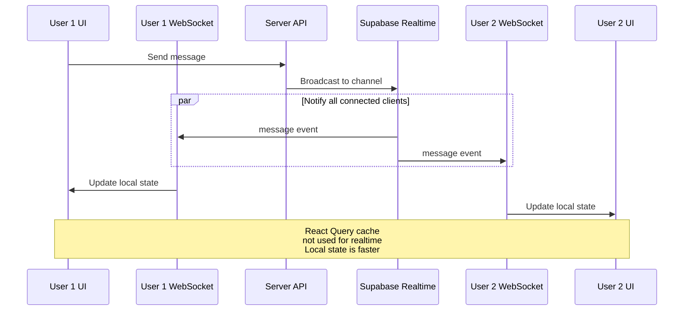
```mermaid
sequenceDiagram
    participant U1 as User 1 UI
    participant WS1 as User 1 WebSocket
    participant API as Server API
    participant RT as Supabase Realtime
    participant WS2 as User 2 WebSocket
    participant U2 as User 2 UI

    U1->>API: Send message
    API->>RT: Broadcast to channel

    par Notify all connected clients
        RT->>WS1: message event
        RT->>WS2: message event
    end

    WS1->>U1: Update local state
    WS2->>U2: Update local state

    Note over U1,U2: React Query cache<br/>not used for realtime<br/>Local state is faster
```

### Hybrid State Management

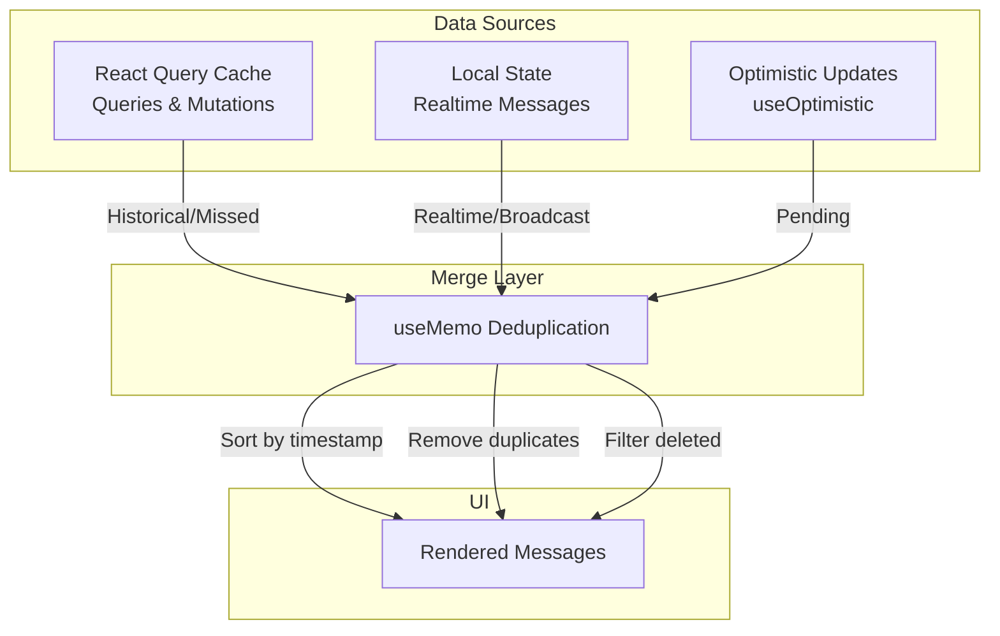
```mermaid
flowchart TB
    subgraph "Data Sources"
        A[React Query Cache<br/>Queries & Mutations]
        B[Local State<br/>Realtime Messages]
        C[Optimistic Updates<br/>useOptimistic]
    end

    subgraph "Merge Layer"
        D[useMemo Deduplication]
    end

    subgraph "UI"
        E[Rendered Messages]
    end

    A -->|Historical/Missed| D
    B -->|Realtime/Broadcast| D
    C -->|Pending| D

    D -->|Sort by timestamp| E
    D -->|Remove duplicates| E
    D -->|Filter deleted| E
```

### Why Not React Query for Messages?

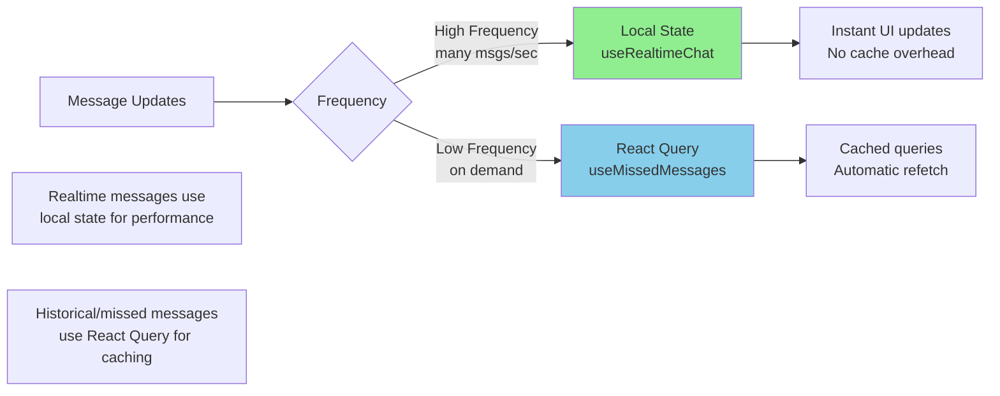
```mermaid
flowchart LR
    A[Message Updates] --> B{Frequency}

    B -->|High Frequency<br/>many msgs/sec| C[Local State<br/>useRealtimeChat]
    B -->|Low Frequency<br/>on demand| D[React Query<br/>useMissedMessages]

    C --> E[Instant UI updates<br/>No cache overhead]
    D --> F[Cached queries<br/>Automatic refetch]

    style C fill:#90EE90
    style D fill:#87CEEB

    Note1[Realtime messages use<br/>local state for performance]
    Note2[Historical/missed messages<br/>use React Query for caching]
```

## Complete Data Flow Example

### New User Joins Room

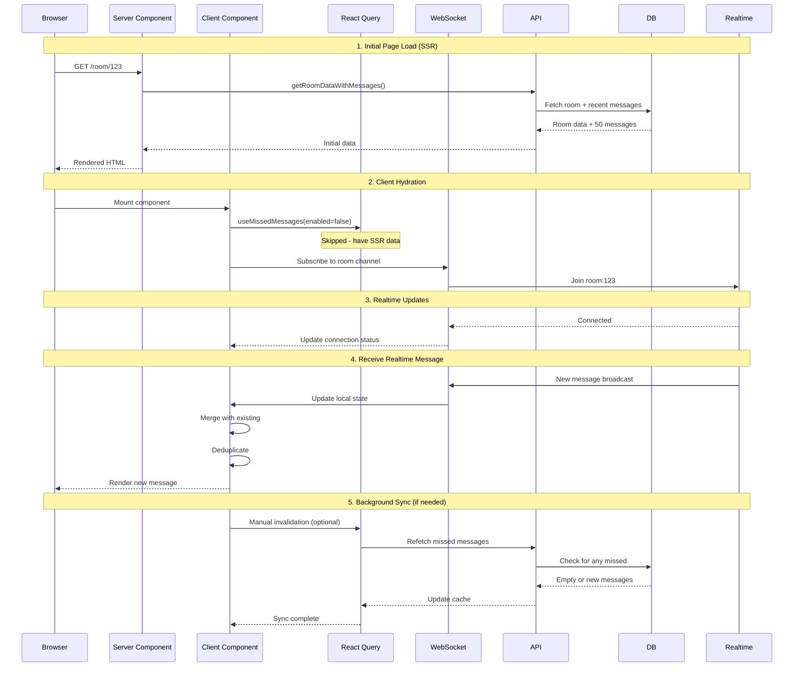
```mermaid
sequenceDiagram
    participant Browser
    participant SSR as Server Component
    participant UI as Client Component
    participant RQ as React Query
    participant WS as WebSocket
    participant API
    participant DB
    participant RT as Realtime

    Note over Browser,RT: 1. Initial Page Load (SSR)

    Browser->>SSR: GET /room/123
    SSR->>API: getRoomDataWithMessages()
    API->>DB: Fetch room + recent messages
    DB-->>API: Room data + 50 messages
    API-->>SSR: Initial data
    SSR-->>Browser: Rendered HTML

    Note over Browser,RT: 2. Client Hydration

    Browser->>UI: Mount component
    UI->>RQ: useMissedMessages(enabled=false)
    Note over RQ: Skipped - have SSR data
    UI->>WS: Subscribe to room channel
    WS->>RT: Join room:123

    Note over Browser,RT: 3. Realtime Updates

    RT-->>WS: Connected
    WS-->>UI: Update connection status

    Note over Browser,RT: 4. Receive Realtime Message

    RT->>WS: New message broadcast
    WS->>UI: Update local state
    UI->>UI: Merge with existing
    UI->>UI: Deduplicate
    UI-->>Browser: Render new message

    Note over Browser,RT: 5. Background Sync (if needed)

    UI->>RQ: Manual invalidation (optional)
    RQ->>API: Refetch missed messages
    API->>DB: Check for any missed
    DB-->>API: Empty or new messages
    API-->>RQ: Update cache
    RQ-->>UI: Sync complete
```

## Performance Optimizations

### Request Deduplication

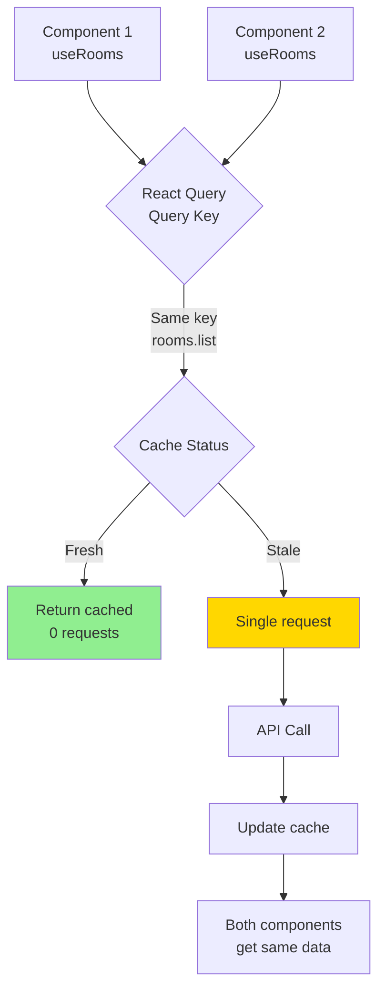
```mermaid
flowchart TD
    A[Component 1<br/>useRooms] --> C{React Query<br/>Query Key}
    B[Component 2<br/>useRooms] --> C

    C -->|Same key<br/>rooms.list| D{Cache Status}

    D -->|Fresh| E[Return cached<br/>0 requests]
    D -->|Stale| F[Single request]

    F --> G[API Call]
    G --> H[Update cache]
    H --> I[Both components<br/>get same data]

    style E fill:#90EE90
    style F fill:#FFD700
```

### Stale-While-Revalidate

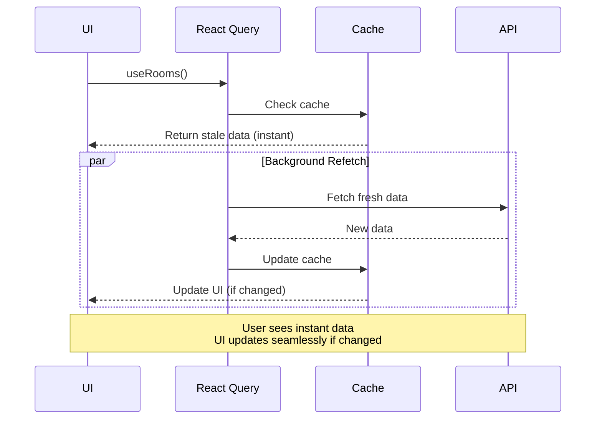
```mermaid
sequenceDiagram
    participant UI
    participant RQ as React Query
    participant Cache
    participant API

    UI->>RQ: useRooms()
    RQ->>Cache: Check cache
    Cache-->>UI: Return stale data (instant)

    par Background Refetch
        RQ->>API: Fetch fresh data
        API-->>RQ: New data
        RQ->>Cache: Update cache
        Cache-->>UI: Update UI (if changed)
    end

    Note over UI,API: User sees instant data<br/>UI updates seamlessly if changed
```

## Summary

This architecture provides:

1. **Fast Initial Loads** - SSR with cached data
2. **Instant Updates** - Optimistic UI + WebSocket
3. **Automatic Sync** - React Query background refetching
4. **Offline Support** - Cached data + queue system
5. **Type Safety** - End-to-end TypeScript
6. **Developer Experience** - React Query DevTools + clear patterns
7. **Scalability** - Separation of concerns + efficient caching

The combination of React Query for HTTP operations and local state for realtime
updates provides the best performance and user experience.
