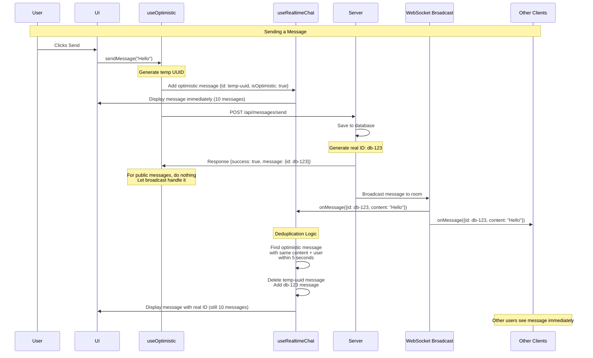
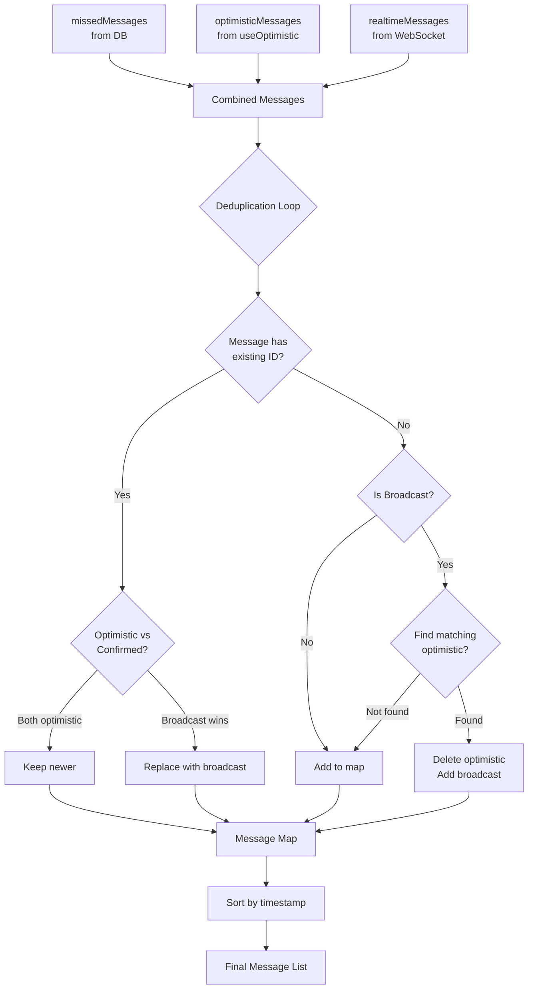
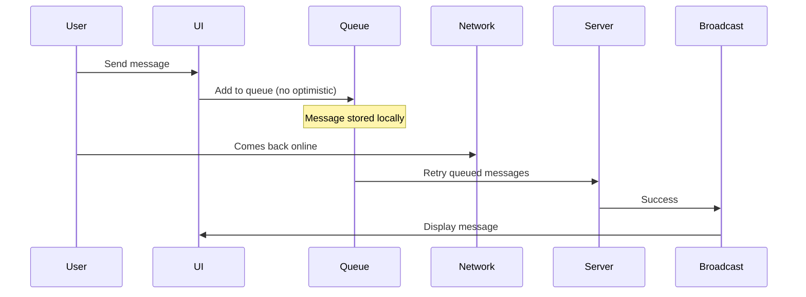
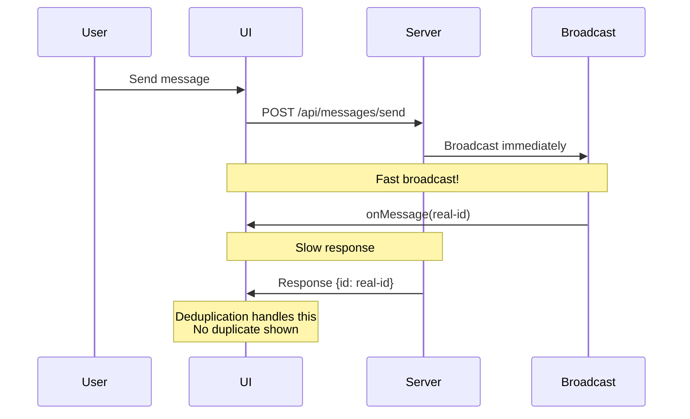

# Message Flow and Deduplication Architecture

This document explains how messages flow through the realtime chat system,
focusing on optimistic updates, broadcast synchronization, and deduplication
logic.

## Overview

The chat system uses **optimistic updates** to provide instant feedback when
sending messages, while synchronizing with broadcast messages from the server to
ensure consistency across all clients.

## Core Concepts

### 1. Message Sources

Messages can come from three different sources:

- **Missed Messages**: Historical messages fetched from the database on initial
  load
- **Optimistic Messages**: Temporary local messages shown immediately when user
  sends a message
- **Broadcast Messages**: Real-time messages received via WebSocket from other
  users (or confirmation of own messages)

### 2. Message States

A message can have several states:

- `isOptimistic: true` - Temporary message, not yet confirmed by server
- `isOptimistic: false` - Confirmed message from server or broadcast
- `isPending: true` - Message is being sent to server
- `isFailed: true` - Message failed to send
- `isDeleted: true` - Message has been unsent

## Message Flow Diagram

## Deduplication Logic

### Problem Statement

When a user sends a message, we can end up with duplicates:

1. **Optimistic message** with temporary UUID (e.g., `temp-abc123`)
2. **Broadcast message** with real database ID (e.g., `db-456789`)

These are the SAME message but with different IDs, which causes flickering if
both appear in the UI.

### Solution: Content-Based Deduplication

The deduplication algorithm works by matching messages based on content rather
than just IDs. When a broadcast message arrives, the system checks if it matches
an existing optimistic message by comparing:

- Message content (exact match)
- User ID (same sender)
- Timestamp (within 5 seconds)

If a match is found, the optimistic message is removed and replaced with the
broadcast message.

### Deduplication Rules

1. **ID Match**: If two messages have the same ID, prefer the non-optimistic
   version
2. **Content Match**: If a broadcast message matches an optimistic message's
   content AND:
   - Same user ID
   - Timestamp within 5 seconds
   - Then replace the optimistic message with the broadcast

### Why 5 Seconds?

The 5-second window accounts for:

- Network latency
- Server processing time
- Broadcast delivery time
- Clock skew between client and server

## Message Merging Flow

## React Hooks Architecture

### useRealtimeChat

The main orchestration hook that:

- Manages confirmed messages state
- Fetches historical messages from database
- Integrates with optimistic updates system
- Handles WebSocket broadcast messages
- Merges and deduplicates all message sources
- Returns final unified message list

### useOptimistic

React's built-in hook for optimistic updates with key behaviors:

- Derives optimistic messages from confirmed messages (base state)
- When base state changes, optimistic overlay is recalculated
- Optimistic messages are temporary and cleared when base state updates
- Provides instant UI feedback without waiting for server

## Edge Cases

### 1. User Sends Message While Offline

### 2. Broadcast Arrives Before Server Response

### 3. Unsending Messages

When a message is unsent:

1. Call unsend API endpoint
2. Server broadcasts `message_unsent` event with message ID to all clients
3. All clients receive the event and mark the message as deleted
4. Message is tracked in a global deleted messages set
5. UI filters out deleted messages and plays exit animation
6. Message smoothly fades out and collapses

## Common Issues and Solutions

### Issue: Message Flickers When Sent

**Symptoms**: Message appears, disappears, reappears

**Cause**: Optimistic message and broadcast message both showing (different IDs)

**Solution**: Content-based deduplication in `useRealtimeChat`

### Issue: Message Count Oscillates

**Symptoms**: Logs show count changing (9 → 10 → 9 → 10)

**Cause**:

- `useOptimistic` re-derives when `confirmedMessages` changes
- Optimistic message reappears after broadcast is added

**Solution**:

- Don't add own broadcast messages to `confirmedMessages` (handled by
  optimistic)
- OR ensure deduplication removes optimistic before adding broadcast

### Issue: Server ID vs Cache ID Conflicts

**Symptoms**: Message IDs don't match between server response and broadcast

**Cause**: Server response has one ID, broadcast has different ID

**Solution**: Use content-based deduplication instead of ID-only matching

## Performance Considerations

### Memoization Strategy

The message merging and deduplication logic uses memoization to avoid expensive
recalculations:

- Only re-runs when source arrays actually change
- Dependencies include missed messages, optimistic messages, and deleted message
  IDs
- Prevents unnecessary re-renders of message list

### Deduplication Complexity

- **Time Complexity**: O(n²) in worst case when checking each message against
  existing messages
- **Space Complexity**: O(n) for storing messages in the deduplication map
- **Optimization**: Early exit when a matching optimistic message is found
- **Trade-off**: Slightly slower deduplication for guaranteed consistency

## Related Files

- `/hooks/chat/use-realtime-chat.tsx` - Main orchestration logic
- `/hooks/messages/use-optimistic-message-sender.tsx` - Optimistic updates
- `/hooks/messages/use-message-merging.tsx` - Message merging and filtering
- `/hooks/messages/use-unsend-message.tsx` - Unsend functionality
- `/hooks/connection/use-websocket-connection.tsx` - WebSocket handling

### In useRealtimeChat

- Number of messages from each source (missed, optimistic, broadcast)
- Message IDs being processed
- When deduplication runs and what it finds

### In Deduplication Logic

- Broadcast message details (ID, content preview)
- Optimistic messages being checked for matches
- Whether content and user IDs match
- Time difference between messages
- Whether replacement occurs

### Common Log Patterns

- **Count oscillating** (9 → 10 → 9 → 10) → Deduplication not working correctly
- **Same message with different IDs** → Need content-based matching instead of
  ID-only
- **Optimistic message never cleared** → Base state not updating properly
- **No deduplication log entries** → Broadcast not triggering deduplication
  check
