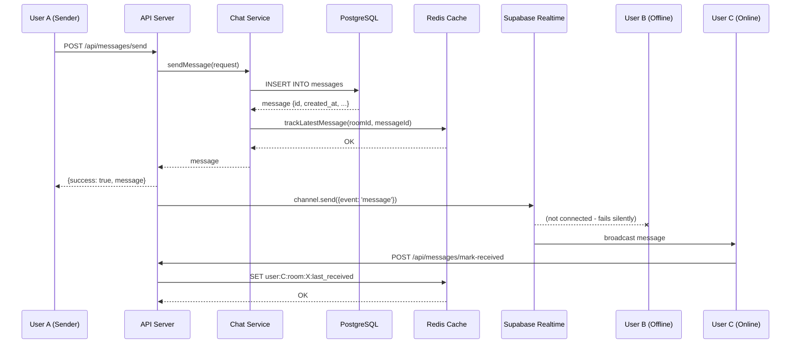
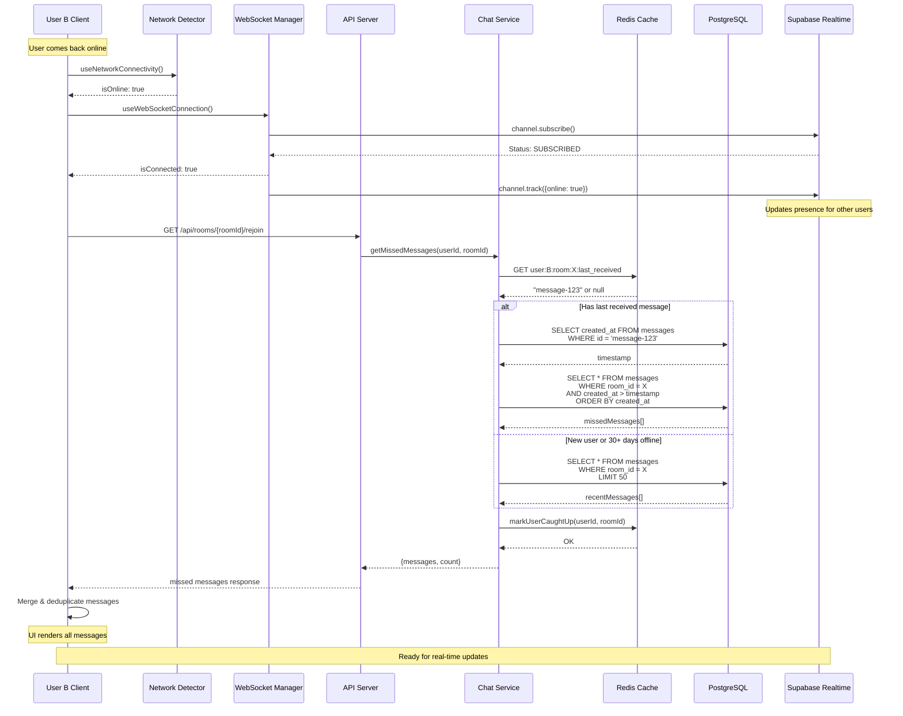
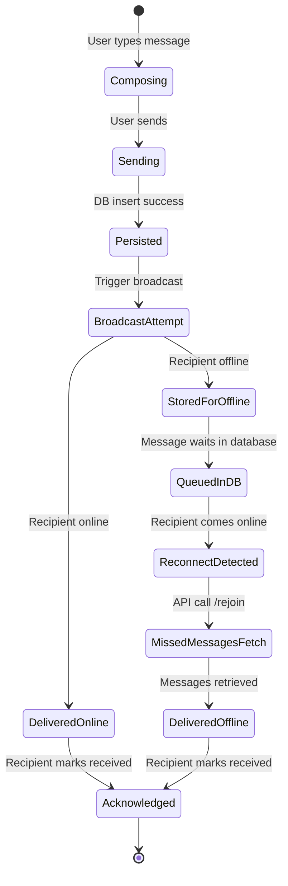
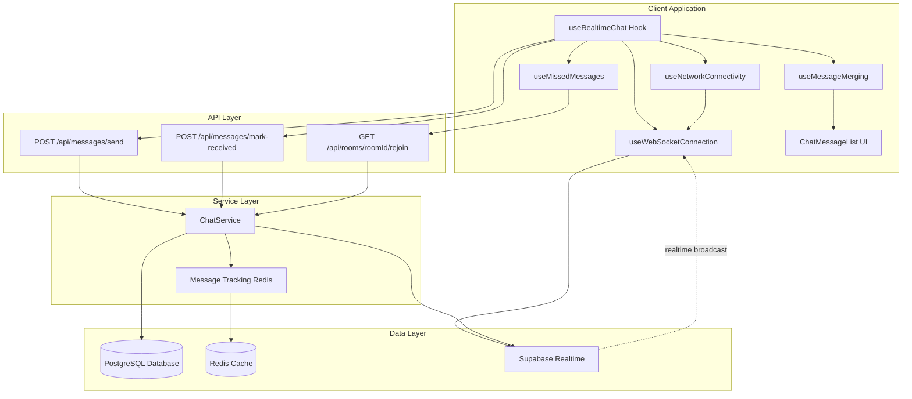
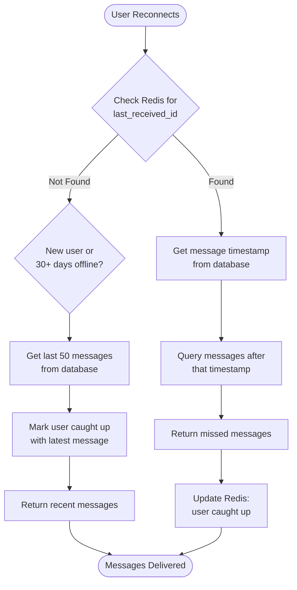

# Offline Messaging System Design

## Overview

This document describes the offline messaging system in the realtime chat
application. The system ensures that messages sent to offline users are reliably
stored and delivered when those users reconnect.

## Architecture

The offline messaging system uses a **hybrid storage approach**:

- **PostgreSQL (Supabase)**: Permanent storage and source of truth for all
  messages
- **Redis**: Lightweight message tracking with delivery pointers
- **Supabase Realtime**: WebSocket-based real-time message delivery for online
  users

## System Components

### 1. Message Storage

All messages are persisted in the PostgreSQL `messages` table:

```sql
CREATE TABLE messages (
  id TEXT PRIMARY KEY,
  room_id UUID NOT NULL,
  user_id UUID NOT NULL,
  content TEXT NOT NULL,
  created_at TIMESTAMP WITH TIME ZONE DEFAULT NOW(),
  deleted_at TIMESTAMP WITH TIME ZONE DEFAULT NULL,
  ...
);
```

### 2. Message Tracking (Redis)

Redis stores lightweight pointers to track message delivery:

```
user:{userId}:room:{roomId}:last_received → messageId (TTL: 30 days)
room:{roomId}:latest_message_id → messageId
```

**Key Points:**

- Only stores message IDs, not full content
- 30-day TTL prevents indefinite growth
- Can be rebuilt from database if lost

### 3. Presence Detection

**Client-Side Network Detection:**

- Browser Navigator API (`navigator.onLine`)
- Network event listeners (`online`, `offline`)
- Tab visibility monitoring

**WebSocket Connection Status:**

- Supabase Realtime channel subscription
- Heartbeat every 30 seconds
- Automatic reconnection on failures

## UML Sequence Diagrams

### Flow 1: Sending Message to Offline User



### Flow 2: User Reconnecting and Receiving Missed Messages



### Flow 3: Message Delivery State Machine



### Flow 4: Component Interaction Diagram



## Message Retrieval Logic

When a user reconnects, the system determines which messages to retrieve:



## Key Features

### 1. Automatic Message Persistence

- **All messages saved to database first**, regardless of recipient status
- Database serves as single source of truth
- Messages persist permanently (unless soft-deleted)

**Implementation:** `lib/services/chat-service.ts:60-100`

### 2. Redis-Based Delivery Tracking

- Tracks last received message ID per user per room
- Minimal memory footprint (IDs only, not full content)
- 30-day TTL for automatic cleanup
- Fallback to database queries if Redis data lost

**Implementation:** `lib/redis/message-tracking/index.ts`

### 3. Smart Missed Message Retrieval

- **Recent users**: Get messages since last received
- **New users**: Get last 50 messages for context
- **Long-absent users (30+ days)**: Reset to recent 50 messages

**Implementation:** `lib/services/chat-service.ts:151-323`

### 4. Client-Side Deduplication

- Messages deduplicated by ID
- Optimistic updates merged with confirmed messages
- Timestamp-based duplicate detection (within 5 seconds)

**Implementation:** `hooks/messages/use-message-merging.tsx`

### 5. Automatic Reconnection

- Network state changes trigger reconnection
- WebSocket errors trigger retry (3 second delay)
- Heartbeat every 30 seconds detects stale connections

**Implementation:** `hooks/connection/use-websocket-connection.tsx`

## Error Handling

### Network Failures

1. **Message Send Failure**
   - Client retries automatically (up to 3 attempts)
   - Shows retry UI to user
   - Stores failed messages locally for manual retry

2. **Reconnection Failure**
   - Exponential backoff retry strategy
   - Maximum retry limit prevents infinite loops
   - User notified of connection issues

### Data Consistency

1. **Redis Cache Miss**
   - Fallback to database query
   - Fetch last 50 messages as baseline
   - Rebuild Redis tracking

2. **Database Query Failure**
   - Return error to client
   - Client can retry or show cached messages
   - Logs error for monitoring

## Performance Characteristics

### Message Sending (Online Recipients)

- **Database Write**: ~10-50ms
- **Redis Update**: ~1-5ms
- **WebSocket Broadcast**: ~5-20ms
- **Total Latency**: ~20-100ms

### Missed Messages Retrieval

- **Redis Lookup**: ~1-5ms
- **Database Query**: ~20-100ms (depends on message count)
- **Message Transform**: ~5-10ms
- **Total Latency**: ~30-150ms for typical case (< 100 messages)

### Scalability Considerations

- **Redis**: Can handle millions of tracking entries
- **Database**: Indexed queries on `room_id` and `created_at`
- **WebSocket**: Supabase Realtime handles connection scaling
- **Pagination**: Limits message retrieval to prevent memory issues

## Security

### Row Level Security (RLS)

Database policies ensure users can only:

- Read messages from rooms they're members of
- Write messages to rooms they're authorized in
- Update their own delivery tracking

**Implementation:** `database/schema.sql`

### Authentication

- All API endpoints protected with `withAuth` middleware
- User ID extracted from authenticated session
- Cannot spoof other users' message tracking

## File Reference

| Component            | File Path                                       | Lines     |
| -------------------- | ----------------------------------------------- | --------- |
| Message Schema       | `database/schema.sql`                           | Full file |
| Send Message API     | `app/api/messages/send/route.ts`                | 35-56     |
| Rejoin API           | `app/api/rooms/[roomId]/rejoin/route.ts`        | Full file |
| Chat Service         | `lib/services/chat-service.ts`                  | 60-323    |
| Redis Tracking       | `lib/redis/message-tracking/index.ts`           | Full file |
| Network Detection    | `hooks/connection/use-network-connectivity.tsx` | Full file |
| WebSocket Connection | `hooks/connection/use-websocket-connection.tsx` | 40-208    |
| Missed Messages Hook | `hooks/messages/use-missed-messages.tsx`        | Full file |
| Realtime Chat Hook   | `hooks/chat/use-realtime-chat.tsx`              | Full file |
| Message Merging      | `hooks/messages/use-message-merging.tsx`        | Full file |

## Future Enhancements

1. **Push Notifications**: Notify offline users via push notifications
2. **Message Batching**: Batch multiple messages in a single retrieval
3. **Compression**: Compress large message payloads
4. **Read Receipts**: Track when messages are actually read vs. just received
5. **Delivery Analytics**: Track delivery rates and latency metrics
