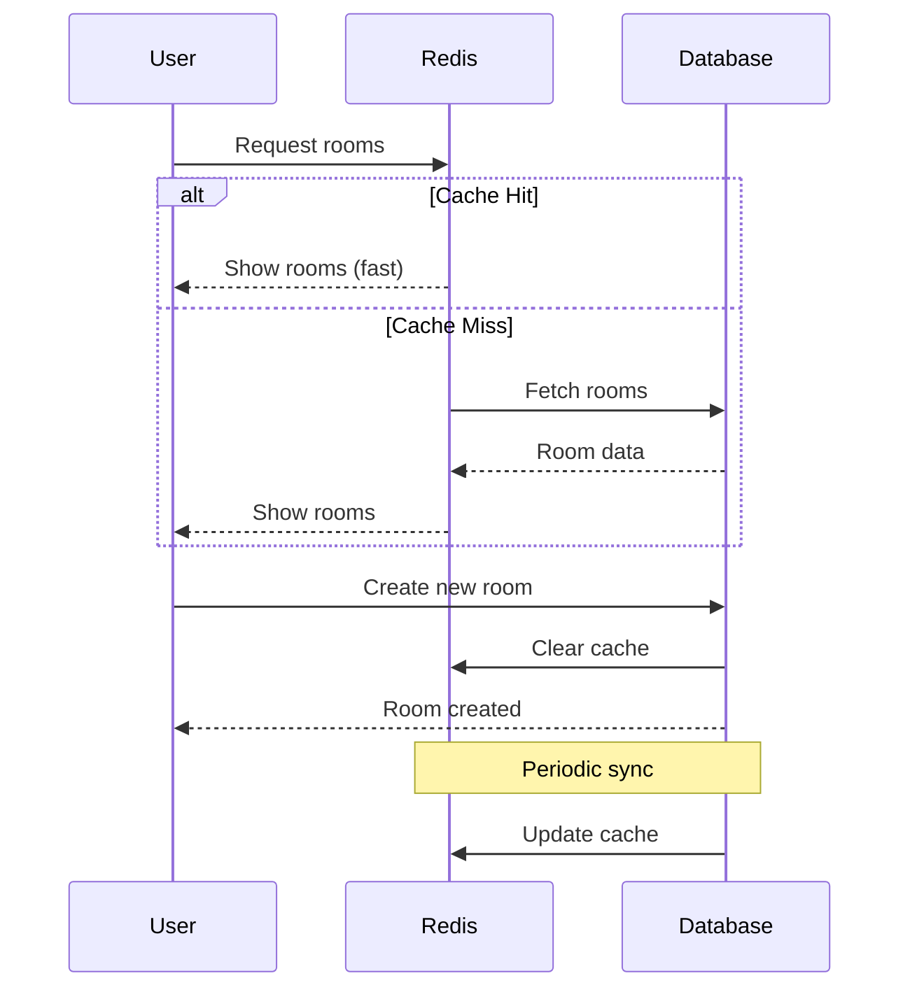

# Redis Room Caching

This document describes the Redis caching for room data in the realtime chat
application.

## Overview

The application now uses Redis caching to optimize room data loading and reduce
database queries. The implementation includes:

- **Server-side rendering (SSR)**: Room data is pre-loaded on the server before
  client hydration
- **Redis caching**: Room data is cached in Redis with configurable TTL
- **Database reconciliation**: Background service to sync cache with database
  changes
- **Cache invalidation**: Automatic cache updates when rooms are
  created/modified

## Architecture

### Key Components

1. **RoomCacheService** (`lib/services/room/room-cache-service.ts`)
   - Handles all Redis caching operations for room data
   - Provides database fallback when cache is unavailable
   - Manages cache TTL and invalidation strategies

2. **RoomReconciliationService**
   (`lib/services/room/room-reconciliation-service.ts`)
   - Background service to sync cached data with database
   - Detects changes and updates cache accordingly
   - Runs automatically in production or when `ENABLE_ROOM_RECONCILIATION=true`

3. **Cache Configuration** (`lib/redis/cache-config.ts`)
   - Centralized cache key patterns and TTL settings
   - Environment-specific configurations
   - Cache utilities and helper functions

4. **Server Actions** (`lib/actions/room-actions.ts`)
   - Server-side functions for fetching initial room data
   - Used for SSR to pre-populate client with room data

### Redis Caching Flow



### Data Flow

#### Initial Page Load (SSR)

1. Server calls `getInitialRoomsData()` during rendering
2. Cache service checks Redis for room data
3. If cache hit: return cached data immediately
4. If cache miss: fetch from database and populate cache
5. Room data is sent to client with initial HTML

#### Client-side Operations

1. `RoomSelector` component receives initial room data as props
2. No loading state shown since data is already available
3. New rooms created through API automatically invalidate cache

#### Background Reconciliation

1. Service runs every 5 minutes (configurable)
2. Compares cached data with database state
3. Updates cache if discrepancies are found
4. Logs reconciliation activities

## Configuration

### Environment Variables

```bash
# Enable background reconciliation (recommended for production)
ENABLE_ROOM_RECONCILIATION=true

# Redis connection (automatically detected)
REDIS_URL=redis://localhost:6379
# OR
KV_REST_API_URL=https://your-upstash-endpoint
KV_REST_API_TOKEN=your-upstash-token
```

### Cache TTL Settings

Default TTL values (configurable in `cache-config.ts`):

- **All rooms list**: 5 minutes (300 seconds)
- **Individual room**: 1 hour (3600 seconds)
- **Sync threshold**: 1 minute (60 seconds)

### Development vs Production

- **Development**: Shorter TTLs (10% of production values)
- **Production**: Full TTL values with background reconciliation
- **Test**: Caching disabled completely

## Benefits

### Performance Improvements

1. **Faster page loads**: Room data is available immediately (no loading
   spinner)
2. **Reduced database queries**: Most room requests served from cache
3. **Better user experience**: Instant room selection without API calls

### Scalability Benefits

1. **Database load reduction**: Fewer direct database queries
2. **Horizontal scaling**: Cache shared across multiple server instances
3. **Resilient fallback**: Always falls back to database if cache fails

## Cache Keys Structure

```
rooms:all                    # List of all rooms
room:{id}                   # Individual room by ID
rooms:last_sync            # Last reconciliation timestamp
rooms:count                # Room count metadata
```

## Monitoring

### Cache Statistics

The system tracks:

- Cache hits vs misses
- Error rates
- Reconciliation frequency
- TTL effectiveness

### Reconciliation Logs

Background reconciliation logs show:

- Changes detected (added/removed/modified rooms)
- Sync frequency and timing
- Error conditions

## API Changes

### Updated Endpoints

- `GET /api/rooms`: Now uses cache-first strategy
- `POST /api/rooms`: Automatically invalidates cache
- `GET /api/rooms/by-id/[roomId]`: Uses individual room cache

### Response Times

Expected improvements:

- Cached responses: ~10-20ms
- Database fallback: ~50-100ms (unchanged)
- Initial page load: ~200-500ms faster

## Future Enhancements

Potential additions:

1. Message caching for chat history
2. User session caching
3. Real-time cache invalidation via WebSockets
4. Cache warming strategies
5. Advanced cache analytics

## Troubleshooting

### Common Issues

1. **Cache not working**: Check Redis connection and environment variables
2. **Stale data**: Verify reconciliation service is running
3. **High memory usage**: Adjust TTL values or implement LRU eviction

### Debug Commands

```bash
# Check Redis connection
bun redis:cli ping

# View cached room data
bun redis:cli get rooms:all

# Monitor reconciliation
tail -f logs/reconciliation.log
```

## Performance Considerations

- Cache warming on application startup
- Background refresh for frequently accessed data
- Graceful degradation when Redis is unavailable
- Memory-efficient key naming patterns
- Configurable TTL based on usage patterns
