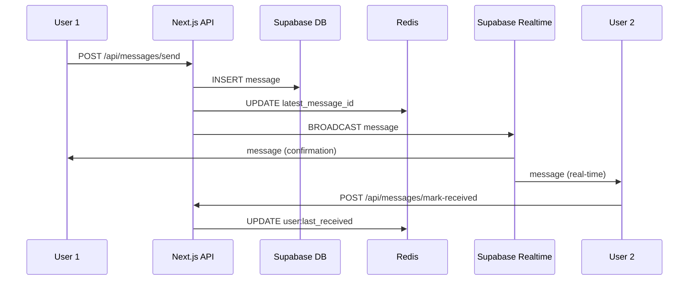
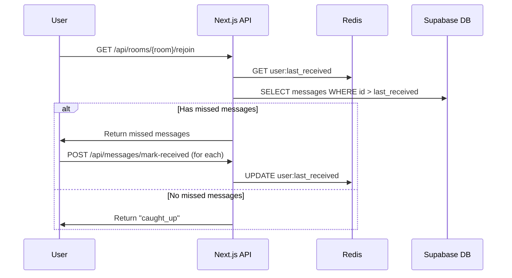

# System Design - Realtime Chat Application

## Overview

This document outlines the system architecture and design decisions for a
scalable, real-time chat application built with Next.js, Supabase, and Redis.
The system handles real-time messaging, message persistence, offline support,
and reliable message delivery.

## Architecture Diagram

```
┌─────────────────┐    ┌─────────────────┐    ┌─────────────────┐
│   Browser 1     │    │   Browser 2     │    │   Browser N     │
│                 │    │                 │    │                 │
│  ┌───────────┐  │    │  ┌───────────┐  │    │  ┌───────────┐  │
│  │ React App │  │    │  │ React App │  │    │  │ React App │  │
│  └───────────┘  │    │  └───────────┘  │    │  └───────────┘  │
└─────────┬───────┘    └─────────┬───────┘    └─────────┬───────┘
          │                      │                      │
          │             WebSocket Connections           │
          │                      │                      │
          └──────────────────────┼──────────────────────┘
                                 │
                    ┌──────────────────────┐
                    │                      │
                    │      Next.js App     │
                    │     (API Routes)     │
                    │                      │
                    └──────────┬───────────┘
                               │
                    ┌──────────┼───────────┐
                    │          │           │
          ┌─────────▼──┐   ┌──▼──────┐   ┌▼──────────┐
          │            │   │         │   │           │
          │  Supabase  │   │  Redis  │   │ Supabase  │
          │  Realtime  │   │  Cache  │   │ Database  │
          │            │   │         │   │(PostgreSQL)│
          └────────────┘   └─────────┘   └───────────┘
```

## Core Components

### 1. Frontend Layer (React/Next.js)

#### Components Architecture

- **RealtimeChat**: Main chat interface component
- **ChatMessage**: Individual message display component
- **useRealtimeChat**: Custom hook managing chat state and real-time connections
- **useChatScroll**: Auto-scroll behavior for message list
- **UserStore**: Zustand store for user session management

#### Key Features

- Real-time message display and sending
- Automatic reconnection handling
- Message deduplication
- Responsive design with Tailwind CSS
- TypeScript for type safety

### 2. API Layer (Next.js API Routes)

#### Message Handling

```
POST /api/messages/send
├── Validate message content
├── Save to Supabase database
├── Update Redis tracking
├── Broadcast via Supabase Realtime
└── Return success response
```

```
POST /api/messages/mark-received
├── Validate user and message IDs
├── Update Redis delivery tracking
└── Return confirmation
```

#### Room Management

```
GET /api/rooms/{roomId}/rejoin?userId={userId}
├── Check user's last received message in Redis
├── Query database for missed messages
├── Return missed messages or "caught up" status
└── Update Redis tracking
```

### 3. Data Layer

#### Supabase Database (PostgreSQL)

```
/database/schema.sql
```

**Purpose**: Permanent message storage, source of truth **Features**:

- Row Level Security (RLS) policies
- Automatic timestamps
- UUID primary keys
- Indexed for efficient queries

#### Redis Cache

```
Key Patterns:
- user:{userId}:room:{roomId}:last_received → messageId
- room:{roomId}:latest_message_id → messageId
```

**Purpose**: Message delivery tracking and performance optimization
**Features**:

- Lightweight key-value storage
- Fast lookup for missed messages
- Ephemeral data (can be rebuilt from database)

#### Supabase Realtime

**Purpose**: WebSocket-based real-time message broadcasting **Features**:

- Channel-based communication
- Automatic connection management
- Built-in reconnection logic

## Message Flow

### 1. Sending a Message



### 2. User Reconnection



## Design Decisions

### 1. Hybrid Storage Strategy

**Decision**: Use both Supabase (persistent) and Redis (ephemeral) storage
**Rationale**:

- **Database**: Reliable, queryable, permanent storage
- **Redis**: Fast delivery tracking, minimal memory footprint
- **Best of both**: Reliability + Performance

### 2. Message Deduplication

**Decision**: Client-side deduplication using message IDs **Rationale**:

- Prevents duplicate messages during reconnections
- Simple implementation
- No additional server complexity

### 3. WebSocket Channel Strategy

**Decision**: One channel per room **Rationale**:

- Natural message isolation
- Efficient broadcasting
- Simple subscription management
- Scalable to multiple rooms

### 4. State Management

**Decision**: Zustand for user state, local state for messages **Rationale**:

- **Zustand**: Lightweight, persistent user sessions
- **Local State**: Messages are ephemeral UI state
- **Separation of concerns**: Different lifecycles

## Scalability Considerations

### 1. Horizontal Scaling

**Current Limitations**:

- Single Redis instance
- Server-side state in API routes

**Solutions for Scale**:

- Redis Cluster for high availability
- Stateless API design (already implemented)
- Database connection pooling
- CDN for static assets

### 2. Performance Optimizations

**Implemented**:

- Redis for fast message lookup
- Message pagination capability
- Efficient React re-renders with useMemo
- Client-side message deduplication

**Future Improvements**:

- Message virtualization for large chat histories
- Image/file upload with CDN
- Message compression
- Connection pooling

### 3. Reliability Features

**Implemented**:

- Missed message recovery
- Automatic reconnection
- Database as source of truth
- Error boundary handling

**Monitoring Needs**:

- Message delivery latency
- WebSocket connection health
- Database query performance
- Redis memory usage

## Security Model

### 1. Authentication

- User identification via unique userId
- No persistent authentication (demo app)
- Room access based on room name knowledge

### 2. Authorization

- Supabase RLS policies for database access
- Public read/write for demo purposes
- API routes validate request structure

### 3. Data Validation

- TypeScript interfaces for type safety
- Server-side content validation
- SQL injection prevention via parameterized queries

## Error Handling

### 1. Network Failures

- Automatic WebSocket reconnection
- Missed message recovery on reconnect
- Graceful degradation of real-time features

### 2. Database Failures

- Error logging via console.error
- User feedback for failed operations
- Redis continues to track state

### 3. Redis Failures

- App continues to function without delivery tracking
- Messages still persist to database
- Manual refresh recovers state

## Development Workflow

### 1. Local Development

```bash
# Start Redis
bun run docker:up

# Start development server
bun run dev

# Monitor Redis (optional)
bun run docker:debug
```

### 2. Testing Strategy

- Multi-instance testing for real-time features
- Redis CLI for debugging delivery tracking
- Database queries for message verification

### 3. Deployment

- Environment variable configuration
- Managed Redis service for production
- Supabase project setup
- Static asset optimization

## Future Enhancements

### 1. Features

- File/image sharing
- Message reactions and threading
- User presence indicators
- Message search functionality
- Push notifications for offline users

### 2. Architecture

- Message encryption for privacy
- Rate limiting for abuse prevention
- Analytics and usage metrics
- Multi-tenant support

### 3. Performance

- Message caching strategies
- Database query optimization
- Real-time typing indicators
- Message compression

## Design Improvements

**Note**: Detailed implementation strategy is available in
`AUTH_IMPLEMENTATION.md`

### 1. Authentication & Authorization Enhancement

#### Current Limitations

- Basic user identification via simple userId strings
- No persistent authentication sessions
- Public read/write access for all users
- Room access based only on room name knowledge

#### Proposed: Supabase Auth Integration

- **Full authentication system** with Supabase Auth
- **JWT-based session management** for secure API access
- **Enhanced database schema** with user profiles and room memberships
- **Row Level Security (RLS) policies** for fine-grained access control
- **Authenticated realtime subscriptions** with user presence tracking

### 2. Security Model Enhancements

#### Database Security

- **User profiles table** linked to Supabase auth users
- **Room memberships table** for access control
- **Enhanced messages table** with proper foreign key relationships
- **RLS policies** ensuring users can only access rooms they've joined
- **Policy-based authorization** at the database level

#### API Security

- **JWT token validation middleware** for all protected routes
- **Room access validation** before allowing message operations
- **User authentication checks** for all sensitive operations
- **Proper error handling** with security-focused responses

#### Realtime Security

- **Authenticated channel subscriptions** with user context
- **Presence tracking** for online/offline status
- **Message broadcasting** only to authorized room members
- **Channel-level security** based on room membership

### 3. Session & State Management

#### Redis Enhancements

- **Session tracking** with TTL-based expiration
- **User presence management** with automatic cleanup
- **Room membership caching** for performance
- **Enhanced key patterns** for authenticated operations

#### Frontend State

- **Auth context provider** for application-wide user state
- **Protected route handling** with automatic redirects
- **Session persistence** across browser refreshes
- **Graceful auth state transitions** during login/logout

### 4. Additional Security Features

#### Content & Abuse Protection

- **Rate limiting** per user and action type
- **Content validation** and basic moderation
- **Message length limits** and format validation
- **Spam prevention** through Redis-based tracking

#### Monitoring & Compliance

- **Audit logging** for security-relevant events
- **Failed authentication tracking** for security monitoring
- **Session management** with proper cleanup
- **GDPR-ready data handling** with user data controls

### 5. Migration Strategy

#### Implementation Phases

1. **Database Migration** - Schema updates and RLS policies
2. **Frontend Updates** - Auth integration and UI updates
3. **API Security** - Middleware and route protection
4. **Testing & Rollout** - Comprehensive testing and gradual deployment

#### Backwards Compatibility

- **Feature flags** for gradual rollout
- **Dual-mode operation** during transition period
- **Data migration scripts** for existing messages
- **Rollback procedures** for safe deployment

## Conclusion

This system design provides a robust foundation for a real-time chat application
with reliable message delivery. The hybrid storage approach ensures both
performance and reliability, while the component architecture supports
maintainability and future enhancements.

The design prioritizes:

- **Reliability**: Messages never lost, automatic recovery
- **Performance**: Fast delivery, minimal latency
- **Simplicity**: Clear separation of concerns
- **Scalability**: Foundation for future growth
- **Security**: Proper authentication and authorization with Supabase Auth and
  RLS

The proposed improvements add enterprise-level security while maintaining the
system's performance characteristics. The authentication layer provides proper
user management, room access control, and message security through PostgreSQL's
Row Level Security features.

The architecture supports the current requirements while providing a clear path
for future enhancements and scale with proper security foundations.
