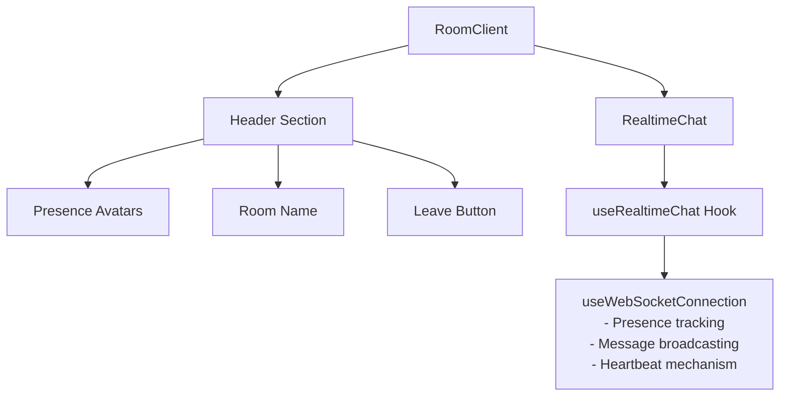
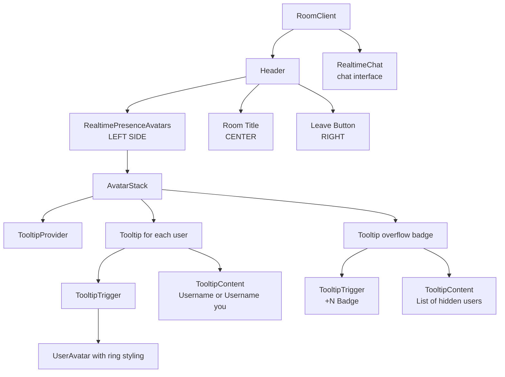
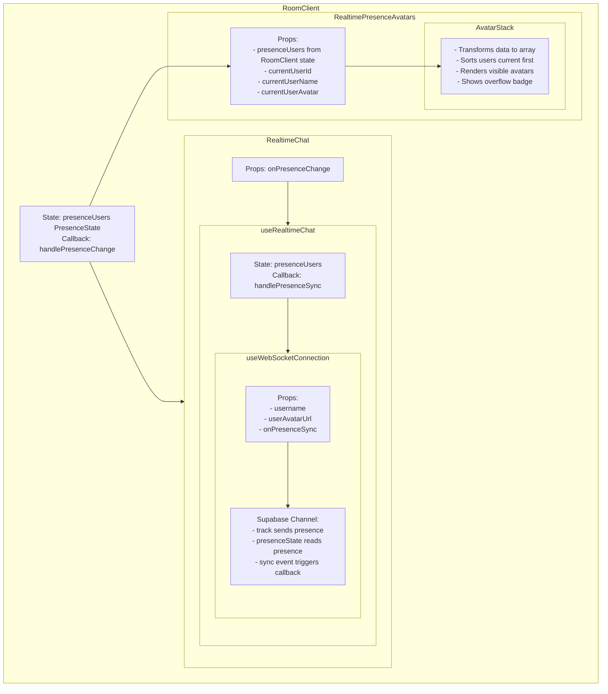
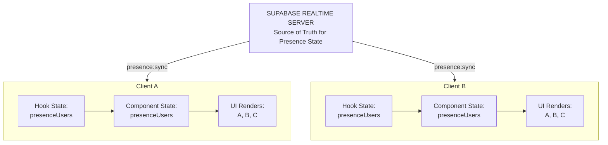

# User Presence System Design

## Overview

The user presence system provides real-time visibility of active users in chat rooms through avatar displays. Users can see who else is currently in a room, with avatars updating dynamically as people join and leave.

### Key Features

- **Real-time presence tracking** - Avatars appear/disappear instantly as users join/leave
- **Avatar stack display** - Overlapping avatars with overflow indicators
- **Current user highlighting** - Your avatar is highlighted with a distinct border
- **Tooltips** - Hover to see full names
- **Efficient architecture** - Single channel approach, minimal overhead
- **Automatic cleanup** - Presence removed on disconnect/navigation

---

## Architecture

### Design Philosophy

**Single Channel Integration** - The presence system leverages the existing Supabase WebSocket channel used for messaging rather than creating a separate presence-only channel. This design choice provides:

- **Lower resource usage** - One channel instead of two
- **Simplified state management** - Single connection state to track
- **Better performance** - Reduced overhead on both client and server
- **Consistency** - Presence and messaging synchronized through same channel

### Component Architecture

---

## Data Flow

### Complete Presence Lifecycle

```mermaid
flowchart TD
    A[USER ENTERS ROOM] --> B[RoomClient Component Initializes<br/>- Receives user data from server SSR<br/>- Sets up presence state<br/>- Creates handlePresenceChange callback]
    B --> C[RealtimeChat Component Mounts<br/>- Receives onPresenceChange prop<br/>- Initializes useRealtimeChat hook]
    C --> D[useRealtimeChat Hook Initializes<br/>- Creates presence state<br/>- Defines handlePresenceSync callback<br/>- Passes username, avatar_url to useWebSocketConnection]
    D --> E[useWebSocketConnection Hook<br/>Step 1: Creates Supabase channel<br/>with broadcast and presence config]
    E --> F[Step 2: Sets up event listeners<br/>- broadcast: message<br/>- broadcast: message_unsent<br/>- presence: sync<br/>- system events]
    F --> G[Step 3: Subscribes to channel<br/>Tracks initial presence with<br/>online, userId, name, avatar_url, timestamps]
    G --> H[SUPABASE REALTIME SERVER<br/>- Receives presence track<br/>- Broadcasts presence:sync to all subscribers<br/>- Includes complete presence state]
    H --> I[Presence 'sync' Event Fires<br/>Gets presenceState and transforms<br/>to PresenceState format]
    I --> J[handlePresenceSync in useRealtimeChat<br/>Updates local presenceUsers state]
    J --> K[useEffect in RealtimeChat Component<br/>Calls onPresenceChange with presenceUsers]
    K --> L[handlePresenceChange in RoomClient<br/>Updates RoomClient's presenceUsers state]
    L --> M[RealtimePresenceAvatars Renders<br/>- Transforms Record to Array<br/>- Ensures current user included<br/>- Sorts: current user first, then alphabetically]
    M --> N[AvatarStack Component Renders<br/>- First 5 users visible<br/>- Calculates overflow<br/>- Highlights current user<br/>- Shows +N badge if overflow]
    N --> O[USER INTERACTION<br/>- Hover shows tooltips<br/>- See real-time updates]
    O --> P[HEARTBEAT MECHANISM<br/>Every 30 seconds<br/>channel.track with updated timestamps]
    P --> O
    O --> Q[USER LEAVES ROOM<br/>- Component unmounts<br/>- Cleanup: supabase.removeChannel<br/>- Supabase removes user from presence<br/>- Avatars update for remaining users]
```

---

## Component Hierarchy

### Visual Component Tree

### Data Flow Between Components

---

## State Synchronization

### State Flow Chart

### Update Propagation

1. **User Action** (join/leave)
   - `channel.track()` or `channel.unsubscribe()`

2. **Server Update**
   - Supabase updates presence registry
   - Triggers `presence:sync` to all subscribers

3. **Client Sync**
   - Each client receives full presence state
   - `onPresenceSync` callback fires

4. **State Cascade**
   - useWebSocketConnection → useRealtimeChat → RealtimeChat → RoomClient

5. **UI Render**
   - React re-renders with new presence data
   - Framer Motion handles transitions (if configured)

---

## Performance Considerations

### Optimization Strategies

#### 1. Memoization

#### 2. Limited Visible Avatars

- Only render 5 avatars by default
- Overflow hidden behind "+N" badge
- Prevents DOM bloat in large rooms

#### 3. Throttled Updates

- Heartbeat every 30 seconds (not on every message)
- Supabase handles presence timeout automatically
- Balance between freshness and network usage

#### 4. Efficient Event Listeners

### Scalability

**Current Design:**
- Handles rooms with 5-10 users optimally
- Gracefully degrades to 50+ users (overflow badge)
- Performance impact minimal due to:
  - Limited visible avatars
  - Single channel architecture
  - Memoized transformations

**Potential Bottlenecks:**
- Very large rooms (100+ users) may cause:
  - Increased sync payload size
  - More frequent re-renders
  - Memory usage from presence state

**Mitigation:**
- Pagination in overflow tooltip
- Virtual scrolling for large user lists
- Room size limits (product decision)

---

## Technical Decisions

### Why Track on Every Heartbeat?

**Rationale:**
- Supabase presence has a timeout mechanism
- Periodic tracking keeps user "alive"
- Detects disconnected clients
- 30-second interval balances freshness vs. network load

**Alternative:** Track only on join/leave
- Risk: Stale presence if client crashes
- Risk: False "online" status for zombie connections

### Why Current User in Presence List?

**User Preference:** Yes, include current user

**Benefits:**
- Confirms you're visible to others
- Shows your connection status
- Consistent with design pattern (Figma, Google Docs)

**Implementation:**
- Highlighted with `ring-primary`
- Sorted first in list
- Tooltip shows "(you)"

---

## Error Handling & Edge Cases

### Connection Loss

**Scenario:** User's internet disconnects

**Behavior:**
1. WebSocket connection drops
2. `setIsConnected(false)` triggered
3. Reconnection logic attempts reconnect
4. On reconnect, presence automatically re-tracked
5. Other users' views update when sync event fires

**User Experience:**
- Avatar may temporarily disappear for others
- Reappears automatically on reconnection
- No manual intervention needed

---

### Integration

**Scenarios:**
1. User joins room → Avatar appears for all
2. User leaves room → Avatar disappears for all
3. Multiple users join → Avatars stack properly
4. Overflow scenario → "+N" badge appears
5. Hover interaction → Tooltip shows name
6. Connection loss → Reconnect and restore presence

---

### Related Documentation

- [Supabase Realtime Presence Docs](https://supabase.com/docs/guides/realtime/presence)

